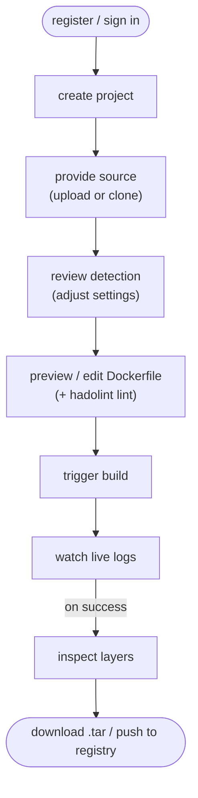

# 1. Introduction

## 1.1 Purpose

Containerising an application with Docker is now a routine expectation, yet writing a
*good* Dockerfile remains a specialised skill. A correct, production-quality Dockerfile
requires knowing the project's language and framework, choosing an appropriate base
image, ordering instructions for effective layer caching, using multi-stage builds to
keep images small, running as a non-root user, and excluding unnecessary files from the
build context. Developers frequently get these details wrong, producing images that are
oversized, insecure, or simply broken.

**DockerForge** addresses this by automating Dockerfile creation. A user provides their
source code; the system detects the language and framework, generates an optimized
Dockerfile from a library of best-practice templates, builds the image while streaming
the logs live, and lets the user download the result or push it to a registry — all
through a web interface, without the user writing a single line of Dockerfile.

## 1.2 What DockerForge Does

In one sentence: DockerForge turns uploaded or cloned source code into an optimized,
ready-to-run Docker image. Concretely, it:

- ingests source code by archive upload or Git clone;
- detects the language, framework, dependency file, entry point, and port, with a
  confidence score;
- generates an optimized, multi-stage, non-root Dockerfile and a matching
  `.dockerignore`, which the user can preview and edit (with live hadolint linting);
- builds the image on the host Docker daemon, streaming build logs to the browser in
  real time, with cancel and retry;
- records every build with its Dockerfile, configuration snapshot, image size, and
  layer breakdown, and can compare two builds layer by layer;
- delivers the result as a downloadable `.tar` or a push to a container registry; and
- manages the image lifecycle, cleaning images up automatically after a configurable
  time-to-live.

## 1.3 Scope

DockerForge is a **self-hosted, multi-user tool**, deployed by a team onto its own
infrastructure — comparable in deployment model to Jenkins, GitLab, or Portainer. It is
deliberately **not** a public sign-up SaaS (Docker builds are resource-intensive and
execute user-supplied instructions, which a public service would have to defend
against), and it is **not** a CI/CD server — it produces images on demand rather than
running pipelines on every commit.

The system supports the most common application stacks through 13 framework-specific
templates spanning Python (FastAPI, Flask, Django), Node.js (Express, NestJS, Vite
SPA), Go, Java (Spring Boot, Maven, Gradle), Rust, and C/C++ (CMake, Makefile).

## 1.4 Document Structure

This technical documentation is organised as follows:

- **Chapter 2 — Project Overview:** the feature set and the end-to-end workflow at a
  glance.
- **Chapter 3 — System Architecture and Design:** the architecture, component,
  deployment, data, and sequence diagrams, the design decisions and their
  justifications, and the technology stack.
- **Chapter 4 — API and Interface Documentation:** conventions, authentication, the
  full endpoint reference, error handling and status codes, the real-time (SSE)
  interfaces, and usage examples.
- **Chapter 5 — Installation and Configuration:** prerequisites, the Docker Compose
  quick-start, dependency versions, the configuration reference, and troubleshooting.
- **Chapter 6 — User Manual:** a task-by-task guide with worked examples.
- **Chapter 7 — Recommendations and Future Work:** engineering lessons, the
  detection heuristic, known limitations, and proposed enhancements.

# 2. Project Overview

## 2.1 Feature Summary

| Capability | Description |
|---|---|
| Source ingestion | Upload a `.zip`/`.tar` archive or clone an `https://` GitHub repository (with optional access token for private repos) |
| Automatic detection | Language, framework, dependency file, entry point, and port, with a confidence score and ambiguity warnings |
| Dockerfile generation | Optimized, multi-stage, non-root Dockerfiles from 13 framework templates, plus a per-language `.dockerignore` |
| In-browser editing + linting | Edit the generated Dockerfile with live hadolint feedback before building |
| Live builds | Background builds with real-time log streaming, cancellation, and retry |
| Build records | Per-build Dockerfile, configuration snapshot, image size, and layer breakdown |
| Build comparison | Layer-by-layer image diff (added/removed/changed/unchanged) with size and duration deltas for successful builds, plus an input diff (Dockerfile/config) that works for builds of any status |
| Delivery | Download the image as a `.tar` or push it to a container registry (with live progress) |
| Image lifecycle | Automatic time-to-live cleanup and safe pruning of only DockerForge-managed images |
| Statistics | Success rate, build durations, image sizes, and cached-vs-no-cache comparison |
| Multi-user accounts | Registration, login, and per-user isolation of projects and builds |

## 2.2 End-to-End Workflow

Each project can be built repeatedly; every build is recorded, comparable, and
independently downloadable or pushable until its image is cleaned up.

## 2.3 Intended Users and Context

DockerForge is aimed at developers and small teams who want correct, optimized
container images without hand-writing and maintaining Dockerfiles — for example, when
standardising images across many services, onboarding developers unfamiliar with Docker
best practices, or quickly containerising a project for evaluation. Because it is
self-hosted, the operating team controls where it runs and how much build capacity it
has.
