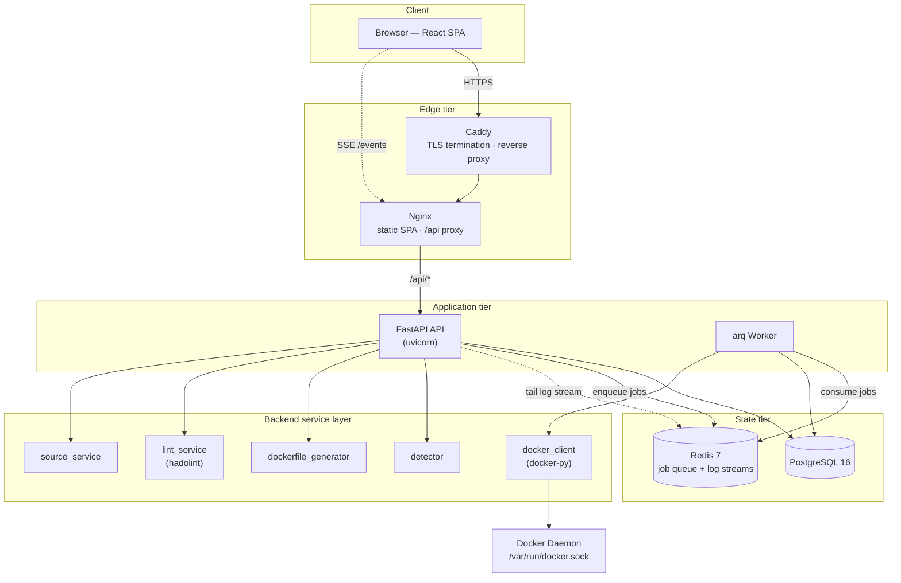
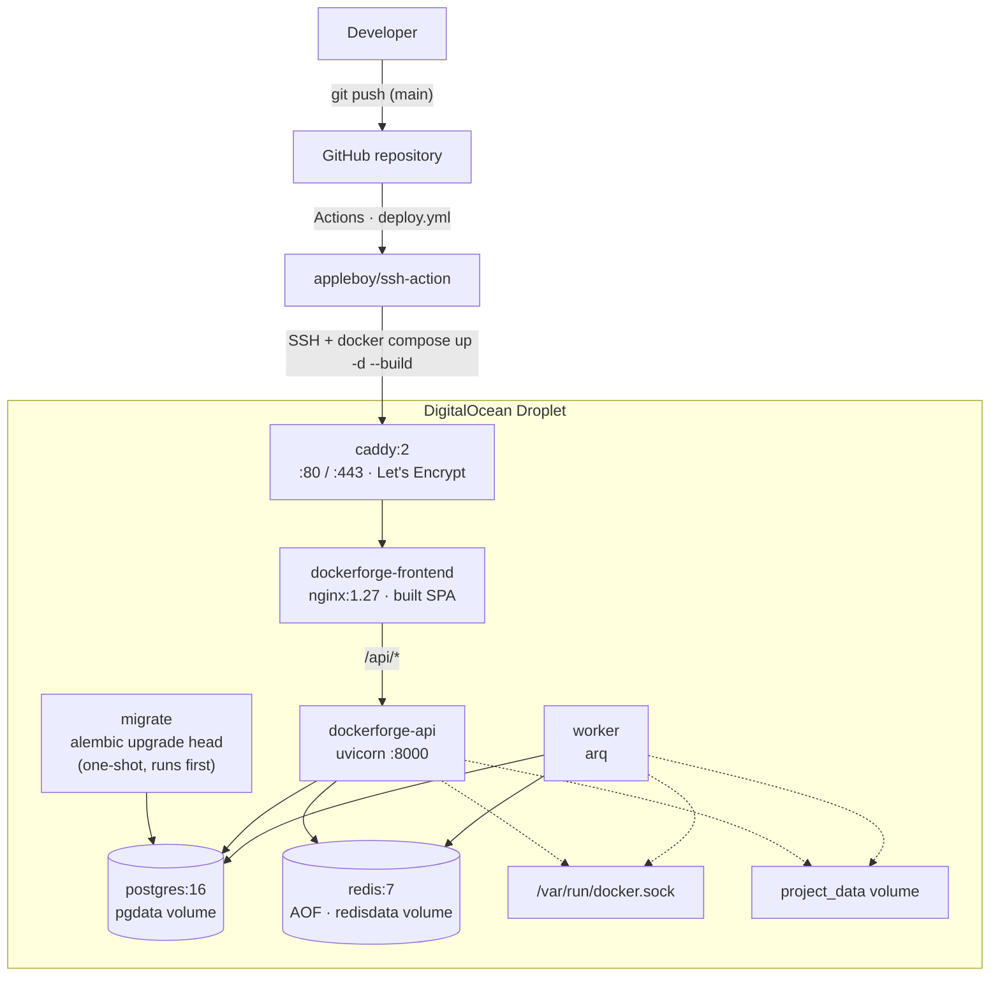
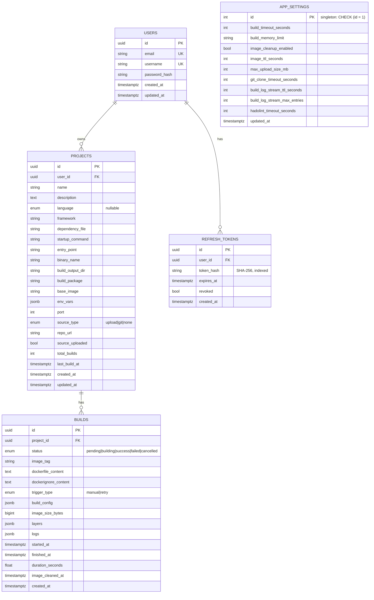
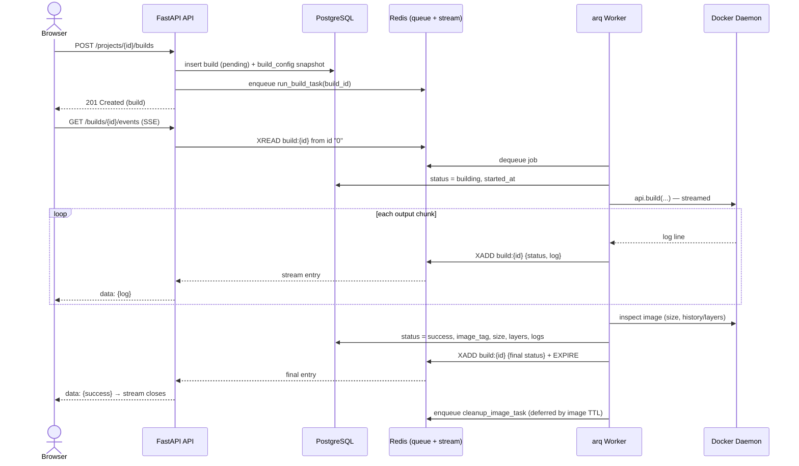
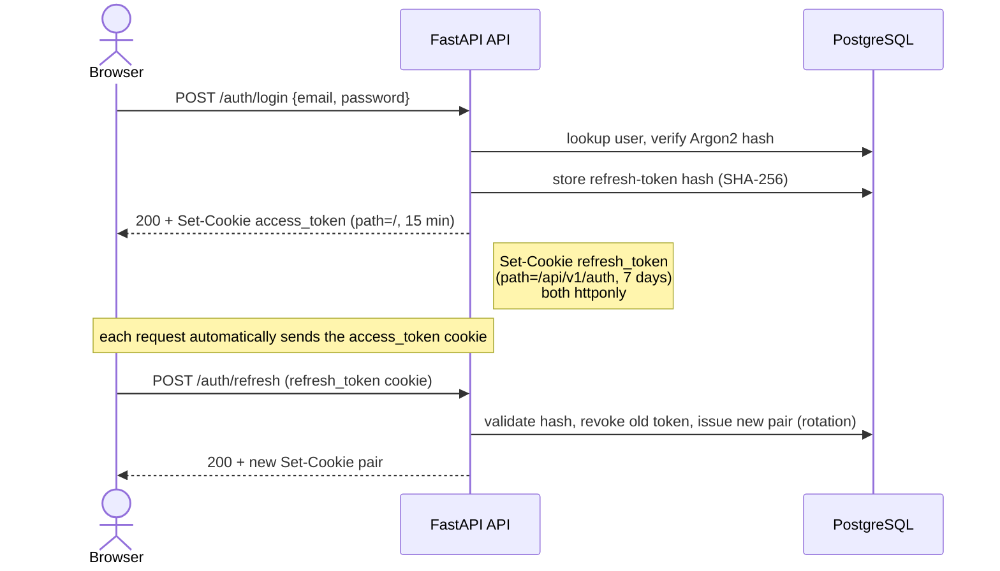

# 3. System Architecture and Design

## 3.1 Architectural Overview

DockerForge is a containerized, multi-process web application built around a clear
separation between **synchronous request handling** and **asynchronous build
execution**. The system is composed of seven cooperating services orchestrated by
Docker Compose, which together form five logical tiers:

1. **Presentation tier** — a React single-page application (SPA) running in the
   user's browser.
2. **Edge tier** — Caddy terminates TLS and reverse-proxies to an Nginx container
   that serves the static SPA bundle and forwards API traffic.
3. **Application tier** — a FastAPI service exposing the REST API, handling
   authentication, request validation, and the Server-Sent Events (SSE) log feed.
4. **Asynchronous processing tier** — an arq worker that executes Docker builds,
   registry pushes, and image cleanup off the request path.
5. **State tier** — PostgreSQL as the system of record and Redis as both the job
   queue and the real-time log-stream transport.

The Docker daemon on the host acts as the **build engine**: both the API and the
worker communicate with it through the mounted Unix socket
(`/var/run/docker.sock`).

The defining architectural characteristic is that **a build request never blocks
an HTTP worker**. When a user triggers a build, the API persists a `pending` build
record, enqueues a job to Redis, and immediately returns `201 Created`. A separate
worker process consumes the job, runs the build, and publishes log lines to a Redis
Stream. The browser receives those lines in real time over an SSE connection that
the API tails from the same stream. This decoupling is what allows the API to
remain responsive while long-running builds (potentially several minutes) proceed
independently, and it allows builds to survive an API restart.

## 3.2 Component Architecture

The following diagram shows the logical components and their primary interactions.

### Component responsibilities

The backend follows a **thin-router / service-layer** pattern. Route handlers in
`app/api/` perform only HTTP concerns — dependency injection, request/response
modelling, and status codes — and delegate all business logic to functions in
`app/services/`. This keeps the logic testable independently of HTTP and avoids
duplicating ownership and validation checks across endpoints.

- **FastAPI API (`app/api/`, `app/main.py`)** — authentication, user/project/build
  CRUD, the Dockerfile preview and lint endpoints, runtime settings, and the SSE
  endpoints for build and push log streaming.
- **arq Worker (`app/worker.py`)** — four job types: `run_build_task` (build an
  image), `run_push_task` (push to a registry), `cleanup_image_task` (TTL image
  removal), and a `prune_managed_images_task` cron job that runs every 15 minutes.
- **detector (`services/detector.py`)** — heuristic language and framework
  detection (see §3.6 and the Recommendations chapter for the scoring model).
- **dockerfile_generator (`services/dockerfile_generator.py`)** — renders one of 13
  framework-specific Jinja2 templates plus a per-language `.dockerignore`.
- **lint_service (`services/lint_service.py`)** — runs hadolint against generated
  or user-edited Dockerfiles.
- **docker_client (`services/docker_client.py`)** — the only module that talks to
  the Docker SDK: building, layer/size inspection, image save, push, and removal.
- **source_service (`services/source_service.py`)** — archive upload extraction and
  hardened git clone.

A single configuration module, `core/languages.py`, holds the `LANGUAGES`
dictionary that drives **detection, template selection, the `/languages` API
response, and default values simultaneously** — a deliberate single-source-of-truth
design so that adding a framework means editing exactly one place.

## 3.3 Deployment Architecture

DockerForge is deployed to a single host (a DigitalOcean Droplet) as a Docker
Compose project (named `dockerforge`), fronted by Caddy for automatic Let's Encrypt HTTPS. Deployment is
fully automated through a GitHub Actions pipeline.

### Deployment characteristics

- **TLS at the edge.** Caddy is the only service exposing public ports (80/443) and
  obtains/renews Let's Encrypt certificates automatically. The served domain comes
  from a `DOMAIN` environment variable (defaulting to `localhost` for local runs),
  so the same Compose file serves both development and production.
- **No direct database or cache exposure.** Postgres and Redis publish no host
  ports; they are reachable only on the internal Compose network. The API and
  frontend ports are likewise unpublished — all external traffic enters through
  Caddy.
- **Ordered startup.** The one-shot `migrate` service runs `alembic upgrade head`
  and must complete successfully before the API and worker start
  (`depends_on: service_completed_successfully`). Postgres and Redis are gated on
  health checks.
- **Shared build state.** The API and worker share the `project_data` volume
  (mounted at `PROJECTS_SOURCE_DIR`) so that source uploaded via the API is visible
  to the worker, and both mount the host Docker socket so the worker can build and
  the API can answer image queries.
- **Reverse-proxy correctness.** Nginx forwards `X-Forwarded-Proto`; uvicorn runs
  with `--proxy-headers --forwarded-allow-ips=*` so the backend generates correct
  `https://` URLs. Collection routes are registered as `@router.<verb>("")` with
  `redirect_slashes=False` to avoid a `307` redirect that browsers would otherwise
  block as mixed content behind TLS.
- **Automated deploy.** A push to `main` triggers `deploy.yml`, which SSHes into the
  Droplet, performs a hard reset to `origin/main`, regenerates `backend/.env` from
  GitHub Secrets/Variables, and runs `docker compose up -d --build`. Concurrency is
  capped to one in-flight deployment.

## 3.4 Data Model

The relational schema consists of four persistent entities plus a singleton
settings row. All primary keys are UUIDs, and all foreign keys cascade on delete.

### Notable data-model decisions

- **UUID primary keys** prevent resource enumeration through sequential IDs and need
  no central coordination to generate.
- **Per-build configuration snapshot (`build_config`, JSONB).** Project settings can
  change between builds; each build stores a complete snapshot (language, framework,
  dependency file, startup command, env vars, build args, `no_cache`) so the
  question "what settings produced build *X*?" always has an answer.
- **Dockerfile and `.dockerignore` stored per build (`TEXT`).** These artifacts are
  a few kilobytes at most, so Postgres stores them trivially and each build keeps an
  exact, reproducible record of what was built — which is also what the build
  comparison feature reads.
- **Structured logs and layers as JSONB.** Logs are stored as an array of
  `{line, message, stream, timestamp}` objects and layers as
  `{instruction, size_bytes, size_human, created_at}`, letting the frontend render
  stderr distinctly, show timings, and drive the layer-comparison chart.
- **Hashed, revocable refresh tokens.** Refresh tokens are stored only as SHA-256
  hashes; on each use the old token is revoked and a new pair issued (rotation).
- **Singleton settings table.** Runtime-tunable limits live in a single
  `app_settings` row enforced by a `CHECK (id = 1)` constraint, so operators can
  change build timeouts, memory limits, and TTLs through the API without restarting
  the server (see §3.6).

## 3.5 Key Workflows

### 3.5.1 Build lifecycle

This is the system's central workflow and the clearest illustration of the
API/worker decoupling and the Redis-Stream-backed log feed.

Cancellation is layered onto this flow: `POST /builds/{id}/cancel` sets a
short-lived `build:{id}:cancel` key in Redis, which the worker polls between Docker
output chunks; when present it closes the build stream and marks the build
`cancelled`. If a client connects after a build has already finished, the SSE
endpoint replays the full history from the still-living stream (`XREAD` from `0`);
if the stream has already expired, it returns `404` and the frontend falls back to
the `GET /builds/{id}/logs` REST endpoint, which reads the persisted JSONB logs.

### 3.5.2 Authentication and token refresh

Tokens are delivered exclusively through `httponly` cookies and are never placed in
the response body or readable by JavaScript. The `access_token` cookie is scoped to
`/`; the `refresh_token` cookie is scoped to `/api/v1/auth` so it is only ever sent
to the auth endpoints. `secure` and `samesite` are derived from `ENVIRONMENT`
(`secure=true`, `samesite=strict` in production; relaxed in development).

## 3.6 Design Decisions and Justifications

**Self-hosted tool, not public SaaS.** Docker builds are resource-intensive and
execute user-supplied build instructions. Framing DockerForge as a self-hosted
internal tool (in the spirit of Jenkins, GitLab, or Portainer) lets the deploying
team size its own infrastructure and sidesteps the abuse-prevention and scaling
burden of a public service, while still exercising full multi-user authentication.

**arq + Redis instead of FastAPI `BackgroundTasks`.** `BackgroundTasks` execute
inside the API process, so an API restart silently kills every in-flight build with
no recovery. Moving builds to an arq worker (a separate Compose service) means the
API can restart without affecting running builds, build state is tracked in Postgres
independently of the worker, and Redis provides the queue and the log transport in
one dependency. The trade-off — an extra service and process — is justified by the
reliability and clean separation it buys.

**Redis Streams instead of pub/sub + a list buffer.** Real-time logs went through
three iterations. Pure pub/sub dropped history for late-joining clients. Adding an
`RPUSH`/`LRANGE` buffer fixed that but introduced two write operations per line, two
read paths, and a race window between replaying the buffer and subscribing. Redis
Streams collapse this into one primitive: a single `XADD` on write, and a single
`XREAD` from id `0` on read that replays history and then tails live updates with no
race and no dual path. The stream is capped (`MAXLEN`) and expires after a
configurable TTL.

**SSE instead of WebSockets.** Build logs flow in one direction only
(server → client). SSE provides exactly that over plain HTTP, passes through proxies
without special handling, and reconnects automatically via the browser's
`EventSource` API. WebSockets' bidirectional channel would be unused complexity.

**Docker socket mount instead of Docker-in-Docker.** Mounting
`/var/run/docker.sock` lets the application use the host daemon directly, avoiding
DinD's privileged-container and storage-driver complications. This is the
conventional approach for self-hosted build tooling. The security implication of
building untrusted code on a shared daemon is mitigated by build timeouts, memory
limits, non-privileged builds, per-build temporary contexts, and symlink-escape
checks, and is discussed further as a limitation in the Recommendations chapter.

**httponly cookie authentication.** Storing JWTs in `httponly` cookies keeps them
out of reach of JavaScript (XSS protection) and means the SPA never has to store or
manage tokens. The design evolved from header-based bearer tokens to cookies once
the frontend integration made the security benefit clear.

**404-masking on unauthorized access.** Accessing another user's resource returns
`404`, not `403`. A `403` would confirm the resource exists; returning `404` for
both "absent" and "forbidden" prevents resource enumeration. The attempt is still
logged at WARNING level for operators.

**Per-build temporary build context.** Each build copies the project source into its
own `tempfile.TemporaryDirectory` before invoking `docker build`. Because the build
writes the `Dockerfile` and `.dockerignore` into the context, two concurrent builds
of the same project would otherwise clobber each other; isolation per build prevents
this, and `copytree(..., symlinks=False)` reinforces the symlink-escape protection.

**Framework-specific templates over language-generic ones.** A single template per
language cannot produce working images across that language's frameworks — a Vite
SPA needs a multi-stage build served by Nginx, NestJS compiles to `dist/`, Django
needs gunicorn and a WSGI path. The system therefore ships 13 framework-specific
templates (`python/{fastapi,flask,django}`, `node/{express,nestjs,vite-spa}`,
`go/default`, `java/{spring-boot,maven,gradle}`, `rust/default`,
`c-cpp/{cmake,makefile}`), all resolved through the central `LANGUAGES` config.

**Runtime settings in the database.** Operational limits (build timeout, memory
limit, image TTL, log-stream retention, upload size, hadolint timeout) live in the
`app_settings` singleton and are editable at runtime via `PATCH /settings`, so
tuning them does not require editing environment variables and restarting the
worker. Process-level settings that genuinely require a restart (worker concurrency,
hard job timeout, source directory) remain environment variables and are surfaced
read-only in the settings response.

**Managed-label image cleanup.** Every generated Dockerfile has
`LABEL dockerforge.managed=true` injected after each `FROM`. Successful builds
schedule a deferred `cleanup_image_task`, and a 15-minute cron job prunes only
*dangling* images carrying that label and older than 10 minutes — so DockerForge
never removes the host's unrelated images.

**LCS-based layer comparison.** Build comparison uses
`difflib.SequenceMatcher.get_opcodes()` over the two builds' layer-instruction
sequences, classifying each layer as `unchanged`, `changed`, `added`, or `removed`.
This is more accurate than exact-string matching, which would report a modified
instruction as a separate removal plus addition. Because layers only exist for a
successful build, this comparison requires both builds to have succeeded (otherwise
`409`). A companion **config comparison** (`/compare/config`) instead diffs the build
*inputs* — the Dockerfile, `.dockerignore`, and `build_config` snapshot — using
`difflib.unified_diff`, and is therefore available for builds in any status (e.g.
contrasting a failed build with the successful one that followed it).

## 3.7 Technology Stack

### Application stack

| Layer | Technology | Version | Purpose |
|---|---|---|---|
| Runtime | Python | 3.12 | Backend language |
| Web framework | FastAPI + uvicorn[standard] | 0.136 / 0.49 | Async REST API + ASGI server |
| ORM | SQLAlchemy (async) + asyncpg | 2.0.50 / 0.31 | Database access |
| Migrations | Alembic | 1.18 | Schema versioning |
| Validation | Pydantic + pydantic-settings | 2.13 / 2.14 | Request/response models, config |
| Task queue | arq | 0.28 | Background build/push/cleanup jobs |
| Redis client | redis-py | 5.3 | Async Redis access (queue + streams) |
| Docker control | docker (docker-py) | 7.1 | Programmatic image builds |
| Templating | Jinja2 | 3.1 | Dockerfile generation |
| Auth | PyJWT + pwdlib[argon2] | 2.13 / 0.3 | JWT tokens, password hashing |
| Logging | loguru | 0.7 | Structured logging |
| Linting | hadolint | v2.12.0 (pinned) | Dockerfile linting |
| Database | PostgreSQL | 16 | System of record |
| Cache/queue/stream | Redis (server) | 7 (AOF) | Job queue + log streams |

Backend Python dependencies are pinned in `requirements.txt`; the complete list with
exact versions appears in the Installation chapter.

### Frontend stack

| Concern | Technology | Version |
|---|---|---|
| Framework | React + TypeScript | 18.3 / 5.7 |
| Build tool | Vite | 6.1 |
| Styling | Tailwind CSS | 3.4 |
| UI primitives | Radix UI, lucide-react, Framer Motion | — |
| Server state | TanStack Query | 5 |
| Client state | Zustand | 5 |
| Routing | React Router | 6.29 |
| Code editor | Monaco | 0.52 |

### Edge and delivery

| Concern | Technology | Version |
|---|---|---|
| TLS / reverse proxy | Caddy | 2 |
| Static server / API proxy | Nginx | 1.27 |
| Frontend build image | Node | 22 (Alpine) |
| Orchestration | Docker Compose | — |
| CI/CD | GitHub Actions (SSH deploy) | — |
| Host | DigitalOcean Droplet | — |

### Base images used by generated Dockerfiles

These are the images the **generated** Dockerfiles target (distinct from
DockerForge's own runtime), and illustrate the multi-stage, slim, non-root defaults
the templates encode: `python:3.12-slim`; `node:20-slim` with `nginx:stable-alpine`
for SPAs; `golang:<detected>-alpine` (default `1.22`, overridden from `go.mod`);
`eclipse-temurin:21-jdk-alpine`; `rust:1.77-slim-bookworm`; and `gcc:13-bookworm`
for C/C++.
