# DockerForge — Technical Documentation

**Authors:** Davit Khachaturovi (Backend), Nika Parkosadze (Frontend)  
**Supervisor:** Giorgi Akhalaia  
**University:** Caucasus University  
**Date:** 6 June 2026

---

# 1. Introduction

## 1.1 Purpose

Containerising an application with Docker is now a routine expectation, yet writing a
*good* Dockerfile remains a specialised skill. A correct, production-quality Dockerfile
requires knowing the project's language and framework, choosing an appropriate base
image, ordering instructions for effective layer caching, using multi-stage builds to
keep images small, running as a non-root user, and excluding unnecessary files from the
build context. Developers frequently get these details wrong, producing images that are
oversized, insecure, or simply broken.

**DockerForge** addresses this by automating Dockerfile creation. A user provides their
source code; the system detects the language and framework, generates an optimized
Dockerfile from a library of best-practice templates, builds the image while streaming
the logs live, and lets the user download the result or push it to a registry — all
through a web interface, without the user writing a single line of Dockerfile.

## 1.2 What DockerForge Does

In one sentence: DockerForge turns uploaded or cloned source code into an optimized,
ready-to-run Docker image. Concretely, it:

- ingests source code by archive upload or Git clone;
- detects the language, framework, dependency file, entry point, and port, with a
  confidence score;
- generates an optimized, multi-stage, non-root Dockerfile and a matching
  `.dockerignore`, which the user can preview and edit (with live hadolint linting);
- builds the image on the host Docker daemon, streaming build logs to the browser in
  real time, with cancel and retry;
- records every build with its Dockerfile, configuration snapshot, image size, and
  layer breakdown, and can compare two builds layer by layer;
- delivers the result as a downloadable `.tar` or a push to a container registry; and
- manages the image lifecycle, cleaning images up automatically after a configurable
  time-to-live.

## 1.3 Scope

DockerForge is a **self-hosted, multi-user tool**, deployed by a team onto its own
infrastructure — comparable in deployment model to Jenkins, GitLab, or Portainer. It is
deliberately **not** a public sign-up SaaS (Docker builds are resource-intensive and
execute user-supplied instructions, which a public service would have to defend
against), and it is **not** a CI/CD server — it produces images on demand rather than
running pipelines on every commit.

The system supports the most common application stacks through 13 framework-specific
templates spanning Python (FastAPI, Flask, Django), Node.js (Express, NestJS, Vite
SPA), Go, Java (Spring Boot, Maven, Gradle), Rust, and C/C++ (CMake, Makefile).

## 1.4 Document Structure

This technical documentation is organised as follows:

- **Chapter 2 — Project Overview:** the feature set and the end-to-end workflow at a
  glance.
- **Chapter 3 — System Architecture and Design:** the architecture, component,
  deployment, data, and sequence diagrams, the design decisions and their
  justifications, and the technology stack.
- **Chapter 4 — API and Interface Documentation:** conventions, authentication, the
  full endpoint reference, error handling and status codes, the real-time (SSE)
  interfaces, and usage examples.
- **Chapter 5 — Installation and Configuration:** prerequisites, the Docker Compose
  quick-start, dependency versions, the configuration reference, and troubleshooting.
- **Chapter 6 — User Manual:** a task-by-task guide with worked examples.
- **Chapter 7 — Recommendations and Future Work:** engineering lessons, the
  detection heuristic, known limitations, and proposed enhancements.

# 2. Project Overview

## 2.1 Feature Summary

| Capability | Description |
|---|---|
| Source ingestion | Upload a `.zip`/`.tar` archive or clone an `https://` GitHub repository (with optional access token for private repos) |
| Automatic detection | Language, framework, dependency file, entry point, and port, with a confidence score and ambiguity warnings |
| Dockerfile generation | Optimized, multi-stage, non-root Dockerfiles from 13 framework templates, plus a per-language `.dockerignore` |
| In-browser editing + linting | Edit the generated Dockerfile with live hadolint feedback before building |
| Live builds | Background builds with real-time log streaming, cancellation, and retry |
| Build records | Per-build Dockerfile, configuration snapshot, image size, and layer breakdown |
| Build comparison | Layer-by-layer image diff (added/removed/changed/unchanged) with size and duration deltas for successful builds, plus an input diff (Dockerfile/config) that works for builds of any status |
| Delivery | Download the image as a `.tar` or push it to a container registry (with live progress) |
| Image lifecycle | Automatic time-to-live cleanup and safe pruning of only DockerForge-managed images |
| Statistics | Success rate, build durations, image sizes, and cached-vs-no-cache comparison |
| Multi-user accounts | Registration, login, and per-user isolation of projects and builds |

## 2.2 End-to-End Workflow

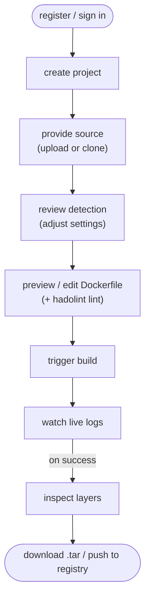

Each project can be built repeatedly; every build is recorded, comparable, and
independently downloadable or pushable until its image is cleaned up.

## 2.3 Intended Users and Context

DockerForge is aimed at developers and small teams who want correct, optimized
container images without hand-writing and maintaining Dockerfiles — for example, when
standardising images across many services, onboarding developers unfamiliar with Docker
best practices, or quickly containerising a project for evaluation. Because it is
self-hosted, the operating team controls where it runs and how much build capacity it
has.

# 3. System Architecture and Design

## 3.1 Architectural Overview

DockerForge is a containerized, multi-process web application built around a clear
separation between **synchronous request handling** and **asynchronous build
execution**. The system is composed of seven cooperating services orchestrated by
Docker Compose, which together form five logical tiers:

1. **Presentation tier** — a React single-page application (SPA) running in the
   user's browser.
2. **Edge tier** — Caddy terminates TLS and reverse-proxies to an Nginx container
   that serves the static SPA bundle and forwards API traffic.
3. **Application tier** — a FastAPI service exposing the REST API, handling
   authentication, request validation, and the Server-Sent Events (SSE) log feed.
4. **Asynchronous processing tier** — an arq worker that executes Docker builds,
   registry pushes, and image cleanup off the request path.
5. **State tier** — PostgreSQL as the system of record and Redis as both the job
   queue and the real-time log-stream transport.

The Docker daemon on the host acts as the **build engine**: both the API and the
worker communicate with it through the mounted Unix socket
(`/var/run/docker.sock`).

The defining architectural characteristic is that **a build request never blocks
an HTTP worker**. When a user triggers a build, the API persists a `pending` build
record, enqueues a job to Redis, and immediately returns `201 Created`. A separate
worker process consumes the job, runs the build, and publishes log lines to a Redis
Stream. The browser receives those lines in real time over an SSE connection that
the API tails from the same stream. This decoupling is what allows the API to
remain responsive while long-running builds (potentially several minutes) proceed
independently, and it allows builds to survive an API restart.

## 3.2 Component Architecture

The following diagram shows the logical components and their primary interactions.

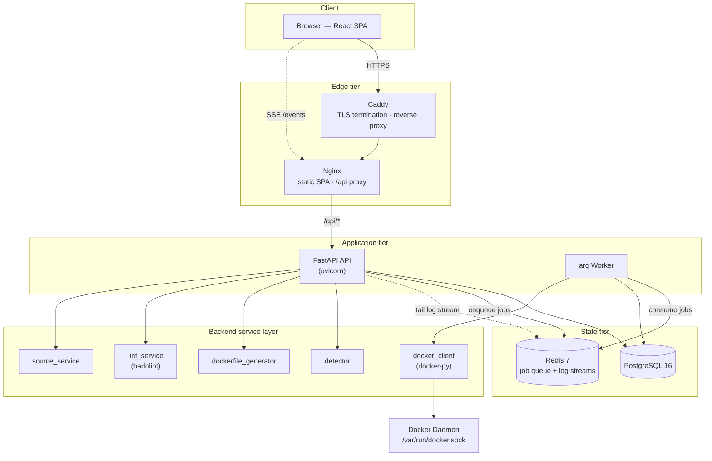

### Component responsibilities

The backend follows a **thin-router / service-layer** pattern. Route handlers in
`app/api/` perform only HTTP concerns — dependency injection, request/response
modelling, and status codes — and delegate all business logic to functions in
`app/services/`. This keeps the logic testable independently of HTTP and avoids
duplicating ownership and validation checks across endpoints.

- **FastAPI API (`app/api/`, `app/main.py`)** — authentication, user/project/build
  CRUD, the Dockerfile preview and lint endpoints, runtime settings, and the SSE
  endpoints for build and push log streaming.
- **arq Worker (`app/worker.py`)** — four job types: `run_build_task` (build an
  image), `run_push_task` (push to a registry), `cleanup_image_task` (TTL image
  removal), and a `prune_managed_images_task` cron job that runs every 15 minutes.
- **detector (`services/detector.py`)** — heuristic language and framework
  detection (see §3.6 and the Recommendations chapter for the scoring model).
- **dockerfile_generator (`services/dockerfile_generator.py`)** — renders one of 13
  framework-specific Jinja2 templates plus a per-language `.dockerignore`.
- **lint_service (`services/lint_service.py`)** — runs hadolint against generated
  or user-edited Dockerfiles.
- **docker_client (`services/docker_client.py`)** — the only module that talks to
  the Docker SDK: building, layer/size inspection, image save, push, and removal.
- **source_service (`services/source_service.py`)** — archive upload extraction and
  hardened git clone.

A single configuration module, `core/languages.py`, holds the `LANGUAGES`
dictionary that drives **detection, template selection, the `/languages` API
response, and default values simultaneously** — a deliberate single-source-of-truth
design so that adding a framework means editing exactly one place.

## 3.3 Deployment Architecture

DockerForge is deployed to a single host (a DigitalOcean Droplet) as a Docker
Compose project (named `dockerforge`), fronted by Caddy for automatic Let's Encrypt HTTPS. Deployment is
fully automated through a GitHub Actions pipeline.

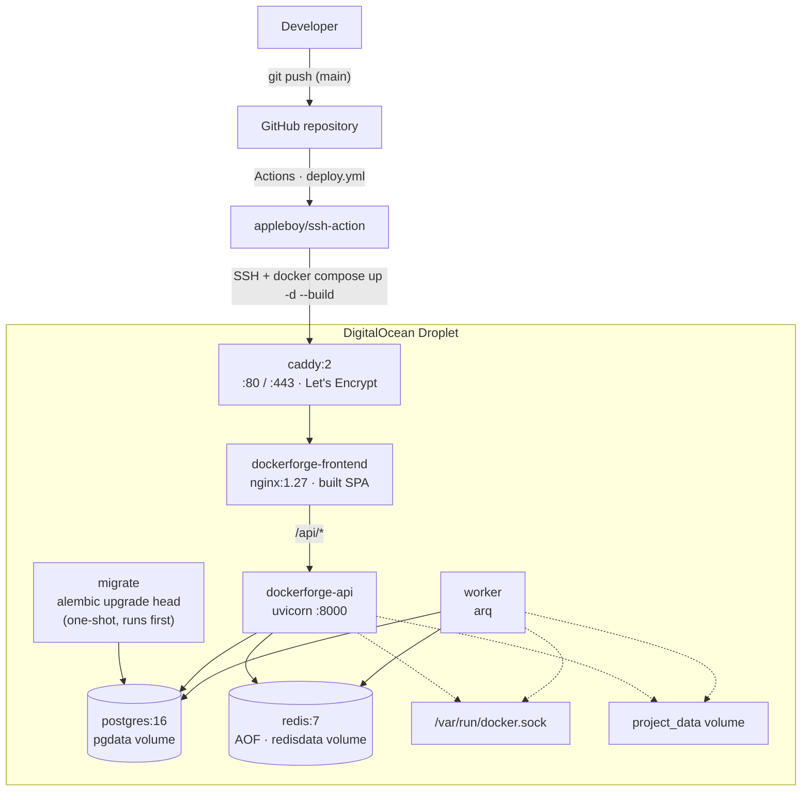

### Deployment characteristics

- **TLS at the edge.** Caddy is the only service exposing public ports (80/443) and
  obtains/renews Let's Encrypt certificates automatically. The served domain comes
  from a `DOMAIN` environment variable (defaulting to `localhost` for local runs),
  so the same Compose file serves both development and production.
- **No direct database or cache exposure.** Postgres and Redis publish no host
  ports; they are reachable only on the internal Compose network. The API and
  frontend ports are likewise unpublished — all external traffic enters through
  Caddy.
- **Ordered startup.** The one-shot `migrate` service runs `alembic upgrade head`
  and must complete successfully before the API and worker start
  (`depends_on: service_completed_successfully`). Postgres and Redis are gated on
  health checks.
- **Shared build state.** The API and worker share the `project_data` volume
  (mounted at `PROJECTS_SOURCE_DIR`) so that source uploaded via the API is visible
  to the worker, and both mount the host Docker socket so the worker can build and
  the API can answer image queries.
- **Reverse-proxy correctness.** Nginx forwards `X-Forwarded-Proto`; uvicorn runs
  with `--proxy-headers --forwarded-allow-ips=*` so the backend generates correct
  `https://` URLs. Collection routes are registered as `@router.<verb>("")` with
  `redirect_slashes=False` to avoid a `307` redirect that browsers would otherwise
  block as mixed content behind TLS.
- **Automated deploy.** A push to `main` triggers `deploy.yml`, which SSHes into the
  Droplet, performs a hard reset to `origin/main`, regenerates `backend/.env` from
  GitHub Secrets/Variables, and runs `docker compose up -d --build`. Concurrency is
  capped to one in-flight deployment.

## 3.4 Data Model

The relational schema consists of four persistent entities plus a singleton
settings row. All primary keys are UUIDs, and all foreign keys cascade on delete.

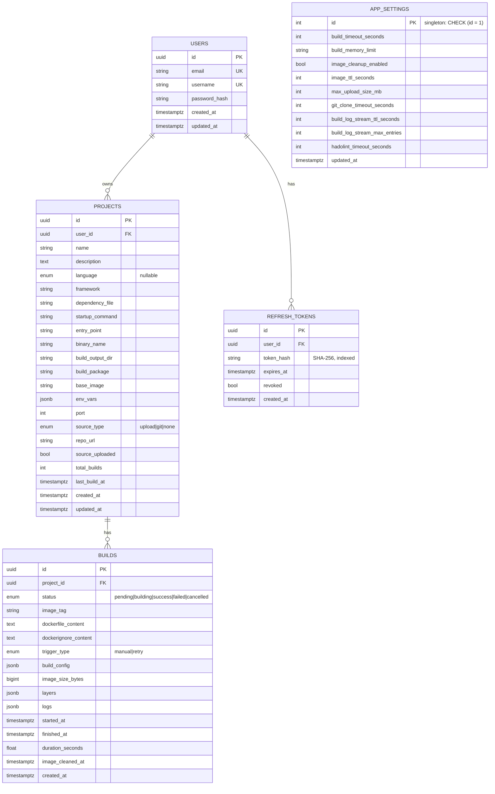

### Notable data-model decisions

- **UUID primary keys** prevent resource enumeration through sequential IDs and need
  no central coordination to generate.
- **Per-build configuration snapshot (`build_config`, JSONB).** Project settings can
  change between builds; each build stores a complete snapshot (language, framework,
  dependency file, startup command, env vars, build args, `no_cache`) so the
  question "what settings produced build *X*?" always has an answer.
- **Dockerfile and `.dockerignore` stored per build (`TEXT`).** These artifacts are
  a few kilobytes at most, so Postgres stores them trivially and each build keeps an
  exact, reproducible record of what was built — which is also what the build
  comparison feature reads.
- **Structured logs and layers as JSONB.** Logs are stored as an array of
  `{line, message, stream, timestamp}` objects and layers as
  `{instruction, size_bytes, size_human, created_at}`, letting the frontend render
  stderr distinctly, show timings, and drive the layer-comparison chart.
- **Hashed, revocable refresh tokens.** Refresh tokens are stored only as SHA-256
  hashes; on each use the old token is revoked and a new pair issued (rotation).
- **Singleton settings table.** Runtime-tunable limits live in a single
  `app_settings` row enforced by a `CHECK (id = 1)` constraint, so operators can
  change build timeouts, memory limits, and TTLs through the API without restarting
  the server (see §3.6).

## 3.5 Key Workflows

### 3.5.1 Build lifecycle

This is the system's central workflow and the clearest illustration of the
API/worker decoupling and the Redis-Stream-backed log feed.

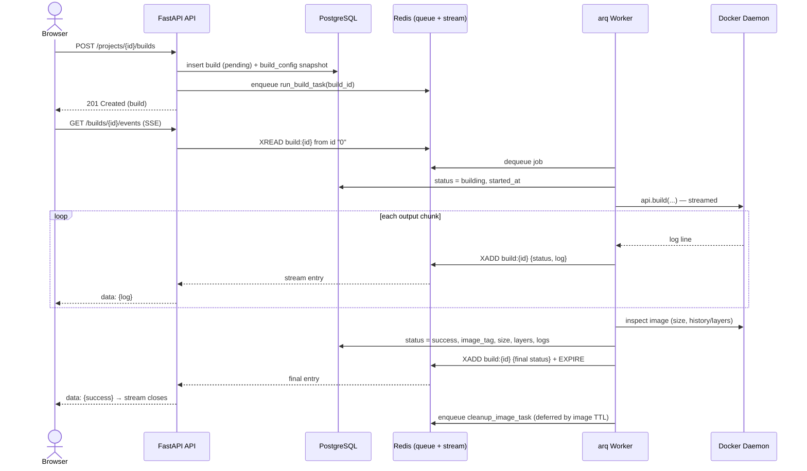

Cancellation is layered onto this flow: `POST /builds/{id}/cancel` sets a
short-lived `build:{id}:cancel` key in Redis, which the worker polls between Docker
output chunks; when present it closes the build stream and marks the build
`cancelled`. If a client connects after a build has already finished, the SSE
endpoint replays the full history from the still-living stream (`XREAD` from `0`);
if the stream has already expired, it returns `404` and the frontend falls back to
the `GET /builds/{id}/logs` REST endpoint, which reads the persisted JSONB logs.

### 3.5.2 Authentication and token refresh

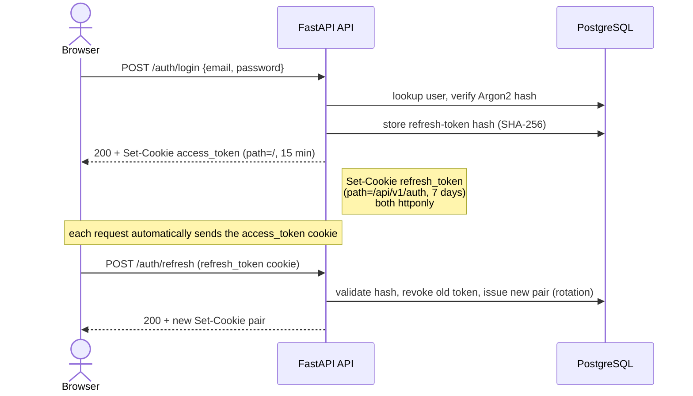

Tokens are delivered exclusively through `httponly` cookies and are never placed in
the response body or readable by JavaScript. The `access_token` cookie is scoped to
`/`; the `refresh_token` cookie is scoped to `/api/v1/auth` so it is only ever sent
to the auth endpoints. `secure` and `samesite` are derived from `ENVIRONMENT`
(`secure=true`, `samesite=strict` in production; relaxed in development).

## 3.6 Design Decisions and Justifications

**Self-hosted tool, not public SaaS.** Docker builds are resource-intensive and
execute user-supplied build instructions. Framing DockerForge as a self-hosted
internal tool (in the spirit of Jenkins, GitLab, or Portainer) lets the deploying
team size its own infrastructure and sidesteps the abuse-prevention and scaling
burden of a public service, while still exercising full multi-user authentication.

**arq + Redis instead of FastAPI `BackgroundTasks`.** `BackgroundTasks` execute
inside the API process, so an API restart silently kills every in-flight build with
no recovery. Moving builds to an arq worker (a separate Compose service) means the
API can restart without affecting running builds, build state is tracked in Postgres
independently of the worker, and Redis provides the queue and the log transport in
one dependency. The trade-off — an extra service and process — is justified by the
reliability and clean separation it buys.

**Redis Streams instead of pub/sub + a list buffer.** Real-time logs went through
three iterations. Pure pub/sub dropped history for late-joining clients. Adding an
`RPUSH`/`LRANGE` buffer fixed that but introduced two write operations per line, two
read paths, and a race window between replaying the buffer and subscribing. Redis
Streams collapse this into one primitive: a single `XADD` on write, and a single
`XREAD` from id `0` on read that replays history and then tails live updates with no
race and no dual path. The stream is capped (`MAXLEN`) and expires after a
configurable TTL.

**SSE instead of WebSockets.** Build logs flow in one direction only
(server → client). SSE provides exactly that over plain HTTP, passes through proxies
without special handling, and reconnects automatically via the browser's
`EventSource` API. WebSockets' bidirectional channel would be unused complexity.

**Docker socket mount instead of Docker-in-Docker.** Mounting
`/var/run/docker.sock` lets the application use the host daemon directly, avoiding
DinD's privileged-container and storage-driver complications. This is the
conventional approach for self-hosted build tooling. The security implication of
building untrusted code on a shared daemon is mitigated by build timeouts, memory
limits, non-privileged builds, per-build temporary contexts, and symlink-escape
checks, and is discussed further as a limitation in the Recommendations chapter.

**httponly cookie authentication.** Storing JWTs in `httponly` cookies keeps them
out of reach of JavaScript (XSS protection) and means the SPA never has to store or
manage tokens. The design evolved from header-based bearer tokens to cookies once
the frontend integration made the security benefit clear.

**404-masking on unauthorized access.** Accessing another user's resource returns
`404`, not `403`. A `403` would confirm the resource exists; returning `404` for
both "absent" and "forbidden" prevents resource enumeration. The attempt is still
logged at WARNING level for operators.

**Per-build temporary build context.** Each build copies the project source into its
own `tempfile.TemporaryDirectory` before invoking `docker build`. Because the build
writes the `Dockerfile` and `.dockerignore` into the context, two concurrent builds
of the same project would otherwise clobber each other; isolation per build prevents
this, and `copytree(..., symlinks=False)` reinforces the symlink-escape protection.

**Framework-specific templates over language-generic ones.** A single template per
language cannot produce working images across that language's frameworks — a Vite
SPA needs a multi-stage build served by Nginx, NestJS compiles to `dist/`, Django
needs gunicorn and a WSGI path. The system therefore ships 13 framework-specific
templates (`python/{fastapi,flask,django}`, `node/{express,nestjs,vite-spa}`,
`go/default`, `java/{spring-boot,maven,gradle}`, `rust/default`,
`c-cpp/{cmake,makefile}`), all resolved through the central `LANGUAGES` config.

**Runtime settings in the database.** Operational limits (build timeout, memory
limit, image TTL, log-stream retention, upload size, hadolint timeout) live in the
`app_settings` singleton and are editable at runtime via `PATCH /settings`, so
tuning them does not require editing environment variables and restarting the
worker. Process-level settings that genuinely require a restart (worker concurrency,
hard job timeout, source directory) remain environment variables and are surfaced
read-only in the settings response.

**Managed-label image cleanup.** Every generated Dockerfile has
`LABEL dockerforge.managed=true` injected after each `FROM`. Successful builds
schedule a deferred `cleanup_image_task`, and a 15-minute cron job prunes only
*dangling* images carrying that label and older than 10 minutes — so DockerForge
never removes the host's unrelated images.

**LCS-based layer comparison.** Build comparison uses
`difflib.SequenceMatcher.get_opcodes()` over the two builds' layer-instruction
sequences, classifying each layer as `unchanged`, `changed`, `added`, or `removed`.
This is more accurate than exact-string matching, which would report a modified
instruction as a separate removal plus addition. Because layers only exist for a
successful build, this comparison requires both builds to have succeeded (otherwise
`409`). A companion **config comparison** (`/compare/config`) instead diffs the build
*inputs* — the Dockerfile, `.dockerignore`, and `build_config` snapshot — using
`difflib.unified_diff`, and is therefore available for builds in any status (e.g.
contrasting a failed build with the successful one that followed it).

## 3.7 Technology Stack

### Application stack

| Layer | Technology | Version | Purpose |
|---|---|---|---|
| Runtime | Python | 3.12 | Backend language |
| Web framework | FastAPI + uvicorn[standard] | 0.136 / 0.49 | Async REST API + ASGI server |
| ORM | SQLAlchemy (async) + asyncpg | 2.0.50 / 0.31 | Database access |
| Migrations | Alembic | 1.18 | Schema versioning |
| Validation | Pydantic + pydantic-settings | 2.13 / 2.14 | Request/response models, config |
| Task queue | arq | 0.28 | Background build/push/cleanup jobs |
| Redis client | redis-py | 5.3 | Async Redis access (queue + streams) |
| Docker control | docker (docker-py) | 7.1 | Programmatic image builds |
| Templating | Jinja2 | 3.1 | Dockerfile generation |
| Auth | PyJWT + pwdlib[argon2] | 2.13 / 0.3 | JWT tokens, password hashing |
| Logging | loguru | 0.7 | Structured logging |
| Linting | hadolint | v2.12.0 (pinned) | Dockerfile linting |
| Database | PostgreSQL | 16 | System of record |
| Cache/queue/stream | Redis (server) | 7 (AOF) | Job queue + log streams |

Backend Python dependencies are pinned in `requirements.txt`; the complete list with
exact versions appears in the Installation chapter.

### Frontend stack

| Concern | Technology | Version |
|---|---|---|
| Framework | React + TypeScript | 18.3 / 5.7 |
| Build tool | Vite | 6.1 |
| Styling | Tailwind CSS | 3.4 |
| UI primitives | Radix UI, lucide-react, Framer Motion | — |
| Server state | TanStack Query | 5 |
| Client state | Zustand | 5 |
| Routing | React Router | 6.29 |
| Code editor | Monaco | 0.52 |

### Edge and delivery

| Concern | Technology | Version |
|---|---|---|
| TLS / reverse proxy | Caddy | 2 |
| Static server / API proxy | Nginx | 1.27 |
| Frontend build image | Node | 22 (Alpine) |
| Orchestration | Docker Compose | — |
| CI/CD | GitHub Actions (SSH deploy) | — |
| Host | DigitalOcean Droplet | — |

### Base images used by generated Dockerfiles

These are the images the **generated** Dockerfiles target (distinct from
DockerForge's own runtime), and illustrate the multi-stage, slim, non-root defaults
the templates encode: `python:3.12-slim`; `node:20-slim` with `nginx:stable-alpine`
for SPAs; `golang:<detected>-alpine` (default `1.22`, overridden from `go.mod`);
`eclipse-temurin:21-jdk-alpine`; `rust:1.77-slim-bookworm`; and `gcc:13-bookworm`
for C/C++.

# 4. API and Interface Documentation

## 4.1 Conventions

The DockerForge backend exposes a versioned REST API. All endpoints are mounted
under a single prefix and served behind the Nginx/Caddy edge.

- **Base path:** `/api/v1`. Behind the reverse proxy the public base URL is
  `https://<domain>/api/v1`; in local development it is `http://localhost/api/v1`.
- **API version:** `0.8` (reported by `GET /`).
- **Content type:** `application/json` for request and response bodies, except
  source upload (`multipart/form-data`), image download (`application/x-tar`), and
  the log-streaming endpoints (`text/event-stream`).
- **Authentication:** session cookies, not bearer headers. After `register`/`login`
  the server sets two `httponly` cookies — `access_token` and `refresh_token`.
  Browsers send them automatically; programmatic clients must use a cookie jar and
  send credentials with each request (e.g. `fetch(..., {credentials: "include"})` or
  `curl -b/-c`). Because the API sets `Access-Control-Allow-Credentials: true`, the
  allowed CORS origins are an explicit list (`CORS_ORIGINS`), not `*`.
- **Validation:** request bodies are validated by Pydantic v2; invalid input returns
  `422` (see §4.3).
- **Pagination:** list endpoints accept `page` (≥1) and `per_page` (1–100) and return
  an envelope: `{ "items": [...], "pagination": { page, per_page, total_items, total_pages } }`.
- **Interactive docs:** when `ENVIRONMENT=dev`, Swagger UI is served at `/docs` and
  ReDoc at `/redoc`. Both are disabled in production. The machine-readable OpenAPI
  3.x document is available at `/openapi.json` (dev) and is also committed to the
  repository at [`docs/openapi.json`](openapi.json).

## 4.2 Authentication and Sessions

Authentication uses short-lived JWT access tokens (15 minutes) and longer-lived
refresh tokens (7 days), both delivered as `httponly` cookies. Tokens never appear
in a response body. The `access_token` cookie is scoped to `/`; the `refresh_token`
cookie is scoped to `/api/v1/auth`, so it is only transmitted to the auth endpoints.

Registration enforces input policies:

- **Username:** 3–30 characters, letters/numbers/underscore/hyphen only, and may not
  start or end with `_` or `-`.
- **Password:** 8–128 characters, with at least one lowercase letter, one uppercase
  letter, one digit, and one special character.

When an access token expires, the client calls `POST /auth/refresh`; the server
validates the refresh token, **revokes it, and issues a new pair** (rotation). The
same password policy applies to `POST /users/me/password`, which additionally
requires the current password.

## 4.3 Error Handling and Status Codes

### Error response shapes

Most errors are raised as standard exceptions and serialize to:

```json
{ "detail": "Human-readable message" }
```

Validation failures (`422`) use FastAPI's structured form:

```json
{ "detail": [ { "loc": ["body", "password"], "msg": "...", "type": "value_error" } ] }
```

Two responses use distinct shapes. When the Docker daemon is unreachable, the API
returns `503` with:

```json
{ "error": "Service Unavailable", "message": "...", "resolution": "Ensure Docker ... is running ..." }
```

An unhandled server error returns `500` with `{ "detail": "Internal server error" }`.

### Status codes

| Code | Meaning in DockerForge |
|---|---|
| 200 OK | Successful read, update, logout, download, settings change |
| 201 Created | Registration, project creation, build trigger, build retry |
| 202 Accepted | Asynchronous action queued (push, cancel) |
| 400 Bad Request | Missing language/framework for preview/lint; build not successful for download; build has no image tag |
| 401 Unauthorized | Invalid/expired access token, wrong token type, user no longer exists, or missing refresh token on refresh/logout |
| 403 Forbidden | No `access_token` cookie present on a protected endpoint |
| 404 Not Found | Resource absent **or** owned by another user (ownership is masked as 404); expired/absent live log stream |
| 409 Conflict | Action invalid for current state — building with no source, retry/cancel on a finished or running build, reading logs while a build is still in progress, comparing builds that were not both successful |
| 410 Gone | The build image has already been cleaned up (download/push/delete) |
| 422 Unprocessable Entity | Request body failed validation |
| 500 Internal Server Error | Unhandled error; settings row missing |
| 503 Service Unavailable | Docker daemon unavailable, or the build/push queue (Redis) is unreachable |

## 4.4 Endpoint Reference

All paths below are relative to the `/api/v1` base. Unless noted, endpoints require
authentication (a valid `access_token` cookie).

### System

**`GET /`** *(unauthenticated, not under `/api/v1`)* — liveness probe. Returns
`{ name, version, status, timestamp }`.

### Auth — `/auth`

**`POST /auth/register`** — create an account. Body: `{ email, username, password }`.
→ `201` `AuthUserResponse` `{ user, token_type, expires_in }`; sets auth cookies.
Errors: `422` (policy violations), `409`/`400` (email or username already taken).

**`POST /auth/login`** — Body: `{ email, password }`. → `200` `AuthUserResponse`; sets
auth cookies. Errors: `401` (bad credentials).

**`POST /auth/refresh`** — uses the `refresh_token` cookie. → `200`
`{ "message": "Tokens refreshed" }`; sets a new cookie pair. Errors: `401` (missing
or invalid refresh token).

**`POST /auth/logout`** — uses the `refresh_token` cookie. → `200`
`{ "message": "Successfully logged out" }`; clears cookies and revokes the token.

### Users — `/users`

**`GET /users/me`** — → `200` `UserProfile`
`{ id, email, username, total_projects, total_builds, created_at, updated_at }`.

**`PATCH /users/me`** — Body (any subset): `{ username?, email? }`. → `200`
`UserProfile`.

**`POST /users/me/password`** — Body: `{ current_password, new_password }`. → `200`.
Errors: `401` (wrong current password), `422` (policy).

### Projects — `/projects`

**`POST /projects`** — Body: `{ name, description? }` (name 1–100, description ≤500).
→ `201` `Project`.

**`GET /projects`** — Query: `page`, `per_page`, `sort_by` (`created_at` |
`updated_at` | `name`), `order` (`asc` | `desc`). → `200` `ProjectListResponse`.

**`GET /projects/{project_id}`** — → `200` `Project`. Errors: `404`.

**`PATCH /projects/{project_id}`** — Body (any subset of project fields, e.g.
`language`, `framework`, `startup_command`, `base_image`, `env_vars`, `port`). →
`200` `Project`.

**`DELETE /projects/{project_id}`** — → `200` `{ "message": ... }`. Cascades to the
project's builds.

### Source ingestion — `/projects/{project_id}/...`

**`POST /projects/{project_id}/upload`** — `multipart/form-data` with a `file` field
(a `.zip`/`.tar` archive). Enforces the configured max upload size. → `200`
`SourceAnalysisResponse`. Errors: `413`/`400` (too large), `400` (bad archive).

**`POST /projects/{project_id}/clone`** — Body: `{ repo_url, branch?, access_token? }`.
`repo_url` must be an `https://github.com/...` URL; `branch` defaults to `main` and is
charset-validated; `access_token` (optional) is used for private repositories via a
git header (never embedded in the URL). → `200` `SourceAnalysisResponse`. Errors:
`422` (invalid URL/branch), `400` (clone failed), `408` (clone timeout).

**`POST /projects/{project_id}/detect`** — re-run language/framework detection against
the already-present source. → `200` `SourceAnalysisResponse`. Errors: `409` (no
source).

`SourceAnalysisResponse` contains the detection result:
`{ detected_language, detected_framework, confidence, detected_dependency_file, suggested_startup_command, detected_entry_point, detected_binary_name, detected_build_output_dir, detected_build_package, detected_base_image, detected_port, detected_files, has_existing_dockerfile, note, warnings }`.

### Dockerfile — `/projects/{project_id}/dockerfile/...`

**`POST /projects/{project_id}/dockerfile/preview`** — generate the Dockerfile and
`.dockerignore` from the project's current settings, with optional inline overrides.
Body (optional `DockerfileOverrides`): `{ base_image?, language?, framework?, dependency_file?, startup_command?, entry_point?, binary_name?, build_output_dir?, build_package?, port?, env_vars? }`.
→ `200` `{ dockerfile_content, dockerignore_content, base_image, warnings }`. Errors:
`400` (language/framework not set, or unsupported framework).

**`POST /projects/{project_id}/dockerfile/lint`** — lint a Dockerfile with hadolint.
Body (optional): `{ dockerfile? }`. If omitted, the project's Dockerfile is generated
first and linted. → `200` `{ issues: [ { code, message, level, line, column } ] }`
where `level` is `error` | `warning` | `info` | `style`. Errors: `503` (hadolint not
installed), `408` (hadolint timeout), `400` (language/framework not set).

### Builds — `/projects/{project_id}/builds`

**`POST .../builds`** — trigger a build. Body (all optional):
`{ custom_dockerfile?, custom_dockerignore?, image_tag?, env_vars?, build_args?, no_cache? }`.
`image_tag` is validated against Docker reference rules (lowercase repository,
≤255 chars). → `201` `Build`. Errors: `409` (no source), `503` (queue unavailable).

**`GET .../builds`** — Query: `page`, `per_page`, `status?`
(`pending`|`building`|`success`|`failed`|`cancelled`). → `200` `BuildListResponse`.

**`GET .../builds/compare`** — Query: `build_a_id`, `build_b_id` (both UUIDs). →
`200` `BuildComparisonResponse`
`{ build_a, build_b, size_diff_bytes, size_diff_human, duration_diff_seconds, layer_comparison: [ { instruction, size_a, size_b, diff_bytes, status } ] }`
where `status` is `unchanged` | `changed` | `added` | `removed`. This compares image
artifacts (size, layers), so both builds must have succeeded. Errors: `409` (a build
was not successful). *(This route is registered before `/{build_id}` so `compare` is
not captured as a build id.)*

**`GET .../builds/compare/config`** — Query: `build_a_id`, `build_b_id` (both UUIDs). →
`200` `BuildConfigComparisonResponse`
`{ build_a, build_b, dockerfile_changed, dockerfile_diff, dockerignore_changed, dockerignore_diff, config_changes: [ { key, value_a, value_b } ] }`
where `*_diff` are unified-diff strings (empty when unchanged) and `config_changes`
lists the differing keys of the build's `build_config` snapshot. Unlike `/compare`,
this diffs only build *inputs* (Dockerfile, `.dockerignore`, config) so it works for
builds in **any** status — e.g. comparing a failed build to the successful one that
followed it. *(Two-segment path, so it is not captured by `/{build_id}`.)*

**`GET .../builds/{build_id}`** — → `200` `BuildDetail` (adds `image_size_bytes`,
`image_size_human`, `layers[]`, and `build_config` to the base `Build`).

**`GET .../builds/{build_id}/logs`** — persisted logs for a finished build. → `200`
`{ build_id, status, logs: [ { line, message, stream, timestamp } ] }`. Errors: `409`
(build still in progress — use `/events` instead).

**`GET .../builds/{build_id}/events`** — live log stream (SSE). See §4.5.

**`GET .../builds/{build_id}/download`** — stream the built image as a `.tar`
(`Content-Disposition: attachment`). Errors: `400` (not successful), `410` (image
cleaned), `404` (image missing from Docker).

**`POST .../builds/{build_id}/push`** — push the image to a registry. Body:
`{ target_tag, repository, username, password }`. → `202` `{ "message": "Push started" }`.
Errors: `400` (not successful / no tag), `410` (image cleaned), `503` (queue
unavailable). Progress is streamed via the push events endpoint.

**`GET .../builds/{build_id}/push/events`** — live push-progress stream (SSE). See §4.5.

**`POST .../builds/{build_id}/retry`** — re-queue a build reusing the original
Dockerfile and config. → `201` `Build`. Errors: `404`, `409` (original still running),
`409` (no source).

**`POST .../builds/{build_id}/cancel`** — request cancellation of a pending/running
build. → `202` `{ "message": ... }`. Errors: `409` (build not in progress).

**`DELETE .../builds/{build_id}/image`** — remove the built image now (before its TTL).
→ `200` `{ "message": "Build image deleted" }`. Errors: `409` (build not successful),
`410` (already cleaned), `400` (no image tag).

### Languages — `/languages`

**`GET /languages`** *(no auth)* — the supported language/framework catalogue that
also drives detection and template selection. → `200`
`{ languages: [ { name, display_name, default_base_image, supports_multi_stage, frameworks: [ { name, display_name, default_entry_point, default_startup_command, default_port, note } ] } ] }`.

### Settings — `/settings`

**`GET /settings`** — current runtime configuration plus the read-only,
environment-derived process settings. → `200` `AppSettings`
`{ build_timeout_seconds, build_memory_limit, image_cleanup_enabled, image_ttl_seconds, max_upload_size_mb, git_clone_timeout_seconds, build_log_stream_ttl_seconds, build_log_stream_max_entries, hadolint_timeout_seconds, updated_at, build_max_concurrent, arq_job_timeout_seconds, project_source_dir }`.

**`PATCH /settings`** — update any subset of the mutable fields. Validated bounds:
`build_timeout_seconds` 30–7200, `image_ttl_seconds` 60–86400, `max_upload_size_mb`
1–2048, `git_clone_timeout_seconds` 10–3600, `build_log_stream_ttl_seconds` 60–86400,
`build_log_stream_max_entries` 100–100000, `hadolint_timeout_seconds` 5–300, and
`build_memory_limit` matching `^\d+(k|m|g)$` (e.g. `512m`, `1g`). The
environment-derived fields (`build_max_concurrent`, `arq_job_timeout_seconds`,
`project_source_dir`) are read-only and ignored if supplied. → `200` `AppSettings`.

## 4.5 Real-Time Interfaces (Server-Sent Events)

Two endpoints stream events as `text/event-stream`. Each event is a single line:

```
data: {"status":"building","log":{"line":12,"message":"Step 3/9 : RUN ...","stream":"stdout","timestamp":"..."}}

```

For **build logs** (`/builds/{id}/events`), the payload is a `StreamEvent`:
`{ status, log: { line, message, stream, timestamp } }`. The stream replays the full
history (the server reads the Redis Stream from id `0`) and then tails live entries.
It closes when a terminal event arrives (`status` of `success`, `failed`, or
`cancelled`). If the build has already finished **and** its stream has expired, the
endpoint returns `404`; clients should then fall back to `GET .../logs`.

For **push progress** (`/builds/{id}/push/events`), the payload mirrors Docker's push
status objects, terminating on a final status or error event.

Clients consume these with the browser `EventSource` API (which reconnects
automatically) or any SSE-capable HTTP client.

## 4.6 Usage Examples

The examples use `curl` with a cookie jar (`cookies.txt`) to persist the session.

**Register and authenticate**

```bash
BASE=http://localhost/api/v1

# Register (also logs in by setting cookies)
curl -c cookies.txt -X POST "$BASE/auth/register" \
  -H "Content-Type: application/json" \
  -d '{"email":"dev@example.com","username":"dev","password":"Sup3r$ecret"}'

# Or log in on an existing account
curl -c cookies.txt -X POST "$BASE/auth/login" \
  -H "Content-Type: application/json" \
  -d '{"email":"dev@example.com","password":"Sup3r$ecret"}'
```

**Create a project and provide source**

```bash
# Create the project
PID=$(curl -b cookies.txt -X POST "$BASE/projects" \
  -H "Content-Type: application/json" \
  -d '{"name":"my-api","description":"demo"}' | jq -r .id)

# Option A: upload an archive
curl -b cookies.txt -X POST "$BASE/projects/$PID/upload" \
  -F "file=@./my-api.zip"

# Option B: clone a public GitHub repo
curl -b cookies.txt -X POST "$BASE/projects/$PID/clone" \
  -H "Content-Type: application/json" \
  -d '{"repo_url":"https://github.com/owner/my-api","branch":"main"}'
```

**Preview the Dockerfile, then build**

```bash
# Preview (optionally override fields)
curl -b cookies.txt -X POST "$BASE/projects/$PID/dockerfile/preview" \
  -H "Content-Type: application/json" -d '{}'

# Trigger a build
BID=$(curl -b cookies.txt -X POST "$BASE/projects/$PID/builds" \
  -H "Content-Type: application/json" \
  -d '{"image_tag":"my-api:latest","no_cache":false}' | jq -r .id)

# Stream live build logs
curl -b cookies.txt -N "$BASE/projects/$PID/builds/$BID/events"
```

**Download or push the image**

```bash
# Download the built image as a tar archive
curl -b cookies.txt -OJ "$BASE/projects/$PID/builds/$BID/download"

# Push to a registry (progress on the push/events stream)
curl -b cookies.txt -X POST "$BASE/projects/$PID/builds/$BID/push" \
  -H "Content-Type: application/json" \
  -d '{"repository":"myuser/my-api","target_tag":"latest","username":"myuser","password":"<token>"}'
```

**Compare two builds (image artifacts — both must have succeeded)**

```bash
curl -b cookies.txt \
  "$BASE/projects/$PID/builds/compare?build_a_id=$BID_A&build_b_id=$BID_B"
```

**Compare two builds' inputs (Dockerfile + config — any status)**

```bash
curl -b cookies.txt \
  "$BASE/projects/$PID/builds/compare/config?build_a_id=$BID_A&build_b_id=$BID_B"
```

## 4.7 OpenAPI Specification

The API is described by an OpenAPI 3.x document generated directly from the FastAPI
application, so it always matches the implemented routes and schemas. The committed
copy lives at [`docs/openapi.json`](openapi.json); on a development instance the same
document is served live at `/openapi.json`, with interactive exploration at `/docs`
(Swagger UI) and `/redoc`.

# 5. Installation and Configuration

DockerForge is designed to run as a Docker Compose stack on a single host. This is
the supported and recommended installation path; a non-Docker development setup is
described in §5.6.

## 5.1 Prerequisites

| Requirement | Version | Notes |
|---|---|---|
| Docker Engine | 24+ | Must expose the Unix socket `/var/run/docker.sock` |
| Docker Compose plugin | v2 | Invoked as `docker compose` (not `docker-compose`) |
| Git | any recent | To clone the repository |
| Open ports | 80, 443 | Published by the Caddy container (production) |

The host's Docker daemon is also the build engine — generated images are built on the
same daemon — so the account running Compose needs permission to use the Docker
socket. No separate Python or Node installation is required for the Docker path; all
builds happen inside containers.

## 5.2 Quick Start (Docker Compose)

```bash
# 1. Clone the repository
git clone <repository-url> dockerforge
cd dockerforge

# 2. Create the backend environment file
cp backend/.env.example backend/.env
```

**3. Edit `backend/.env`.** At minimum, for a Compose deployment:

- Set **`DB_HOST=postgres`** (the example ships `localhost`, which only works when the
  API runs directly on the host — see §5.7).
- Set a strong **`JWT_SECRET_KEY`**.
- For production, set **`ENVIRONMENT=prod`** (enables secure/strict cookies and
  disables the public `/docs`) and a real **`CORS_ORIGINS`**.
- Choose **`DB_USER` / `DB_PASSWORD` / `DB_NAME`** (defaults are all `dockerforge`).

**4. Match the Postgres container credentials.** The `postgres` service reads
`POSTGRES_USER` / `POSTGRES_PASSWORD` / `POSTGRES_DB` from the shell environment
(defaulting to `dockerforge`). These **must equal** the `DB_*` values in
`backend/.env`. If you keep the defaults, nothing more is needed. If you customise
them, export matching values (or place them in a `.env` file in the `docker/`
directory) before starting:

```bash
export POSTGRES_USER=dockerforge POSTGRES_PASSWORD=<your-password> POSTGRES_DB=dockerforge
```

**5. Set the domain (production).** Caddy obtains a Let's Encrypt certificate for
`DOMAIN`. For a public deployment, point a DNS A record at the host and export the
domain; for local use, leave it as `localhost`.

```bash
export DOMAIN=dockerforge.example.com   # production
# export DOMAIN=localhost               # local (default)
```

**6. Build and start the stack.**

```bash
cd docker
docker compose up -d --build
```

The `migrate` service runs `alembic upgrade head` and must finish before the API and
worker start. Once the stack is healthy:

```bash
docker compose ps          # all services "running"/"healthy"; migrate "exited (0)"
```

**7. Open the app** at `https://<DOMAIN>` (or `http://localhost` locally), register
the first user, create a project, and run a build.

To stop the stack: `docker compose down` (add `-v` to also delete the named volumes —
this erases the database, Redis data, and stored project sources).

## 5.3 Dependencies and Versions

### Runtime images (pulled or built by Compose)

| Image | Version | Role |
|---|---|---|
| `postgres` | 16 | Database |
| `redis` | 7-alpine | Job queue + log streams (AOF persistence) |
| `caddy` | 2 | TLS / reverse proxy |
| `nginx` | 1.27-alpine | Serves the built SPA, proxies `/api/` |
| `node` | 22-alpine | Frontend build stage |
| `python` | 3.12-slim | Backend build + runtime stages |
| `hadolint/hadolint` | v2.12.0 | Dockerfile linter (copied into the backend image) |

### Backend Python dependencies (pinned in `backend/requirements.txt`)

```
fastapi==0.136.3
uvicorn[standard]==0.49.0
sqlalchemy[asyncio]==2.0.50
asyncpg==0.31.0
alembic==1.18.4
pydantic-settings==2.14.1
pydantic[email]==2.13.4
PyJWT==2.13.0
pwdlib[argon2]==0.3.0
docker==7.1.0
jinja2==3.1.6
python-multipart==0.0.32
loguru==0.7.3
aiofiles==25.1.0
arq==0.28.0
redis==5.3.1
```

Development tooling (in `requirements-dev.txt`): Black, Ruff, mypy, pre-commit, and
fastapi-cli.

### Frontend dependencies

Declared in `frontend/package.json` and locked in `frontend/package-lock.json`; key
libraries are React 18.3, TypeScript 5.7, Vite 6.1, Tailwind CSS 3.4, TanStack Query
5, Zustand 5, React Router 6.29, and the Monaco editor. The frontend is built with
Node 22 (`npm ci`).

## 5.4 Configuration Reference

DockerForge has three layers of configuration: the backend application environment
(`backend/.env`), the Compose-level variables, and the runtime settings stored in the
database.

### 5.4.1 Backend application environment (`backend/.env`)

| Variable | Default | Purpose |
|---|---|---|
| `DB_USER` | *(required)* | PostgreSQL username |
| `DB_PASSWORD` | *(required)* | PostgreSQL password |
| `DB_HOST` | `postgres` | DB host — use `postgres` under Compose; `localhost` for host-run API |
| `DB_PORT` | `5432` | DB port |
| `DB_NAME` | *(required)* | Database name |
| `REDIS_HOST` | `redis` | Redis host (service name under Compose) |
| `REDIS_PORT` | `6379` | Redis port |
| `JWT_SECRET_KEY` | *(required)* | HMAC signing key — set a long random value |
| `JWT_ALGORITHM` | `HS256` | JWT signing algorithm |
| `JWT_ACCESS_TOKEN_EXPIRE_MINUTES` | `15` | Access-token lifetime |
| `JWT_REFRESH_TOKEN_EXPIRE_DAYS` | `7` | Refresh-token lifetime |
| `BUILD_MAX_CONCURRENT` | `2` | Worker build concurrency (restart required) |
| `ARQ_JOB_TIMEOUT_SECONDS` | `7800` | Hard per-job kill ceiling; must exceed the runtime `build_timeout_seconds` |
| `PROJECTS_SOURCE_DIR` | `/var/lib/dockerforge/projects` | Where uploaded/cloned source is stored (the shared volume mount point) |
| `CORS_ORIGINS` | `http://localhost:3000` | Comma-separated allowed origins (credentials are allowed, so this cannot be `*`) |
| `HOST` | `0.0.0.0` | Bind host |
| `PORT` | `8000` | Bind port |
| `WORKERS` | `4` | uvicorn worker count |
| `LOG_LEVEL` | `info` | Log level |
| `ENVIRONMENT` | `dev` | `dev` or `prod`; controls cookie `secure`/`samesite` and whether `/docs` and `/redoc` are exposed |

> dev behaviour is driven by `ENVIRONMENT`. It can be left in place or
> removed without effect.

### 5.4.2 Compose-level variables

These are read by Docker Compose itself (not the application) and default sensibly
for local use:

| Variable | Default | Purpose |
|---|---|---|
| `POSTGRES_USER` / `POSTGRES_PASSWORD` / `POSTGRES_DB` | `dockerforge` | Postgres container init credentials — **must match the app's `DB_*`** |
| `DOMAIN` | `localhost` | Caddy site address (Let's Encrypt certificate subject) |

### 5.4.3 Runtime settings (database, editable via `PATCH /api/v1/settings`)

These can be changed at runtime without a restart (see §3.6 and §4.4). Defaults and
accepted ranges:

| Setting | Default | Range |
|---|---|---|
| `build_timeout_seconds` | 600 | 30–7200 |
| `build_memory_limit` | `512m` | pattern `\d+(k\|m\|g)` |
| `image_cleanup_enabled` | `true` | — |
| `image_ttl_seconds` | 3600 | 60–86400 |
| `max_upload_size_mb` | 100 | 1–2048 |
| `git_clone_timeout_seconds` | 120 | 10–3600 |
| `build_log_stream_ttl_seconds` | 300 | 60–86400 |
| `build_log_stream_max_entries` | 10000 | 100–100000 |
| `hadolint_timeout_seconds` | 30 | 5–300 |

Note that uploads are additionally capped by the Nginx `client_max_body_size`
directive (500 MB), so the effective upload limit is the smaller of that and
`max_upload_size_mb`.

## 5.5 Production Deployment

The repository ships a GitHub Actions workflow (`.github/workflows/deploy.yml`) that
deploys to a DigitalOcean Droplet on every push to `main`:

1. It connects over SSH (`appleboy/ssh-action`) to the host defined by the
   `DEPLOY_HOST` / `DEPLOY_USER` / `DEPLOY_SSH_KEY` secrets.
2. It performs a hard reset to `origin/main` in `/opt/dockerforge`.
3. It regenerates `backend/.env` from GitHub **Secrets** (`DB_PASSWORD`,
   `JWT_SECRET_KEY`) and **Variables** (`DOMAIN`, `CORS_ORIGINS`, `DB_USER`, `DB_NAME`,
   `ENVIRONMENT`, `DEBUG`), and exports the matching `POSTGRES_*` and `DOMAIN` values.
4. It runs `docker compose -f docker/docker-compose.yml up -d --build --remove-orphans`
   followed by `docker image prune -f`.

Deployment concurrency is limited to one run at a time. To deploy to your own host,
set those repository Secrets/Variables and ensure the host has Docker, the repository
checked out at `/opt/dockerforge`, DNS pointing at it, and ports 80/443 open.

## 5.6 Local Development (without the full stack)

To run the backend directly on your machine you still need PostgreSQL 16 and Redis 7
reachable (the Compose `postgres`/`redis` services do not publish host ports by
default, so either expose them or run your own instances). Then:

```bash
cd backend
python -m venv venv
venv\Scripts\activate            # Windows; use source venv/bin/activate on macOS/Linux
pip install -r requirements.txt
# point .env at your local services:
#   DB_HOST=localhost   REDIS_HOST=localhost
alembic upgrade head
uvicorn app.main:app --reload    # API on :8000
arq app.worker.WorkerSettings    # worker, separate terminal
```

The frontend runs separately with `npm install && npm run dev` in `frontend/`.

## 5.7 Troubleshooting

**API exits at startup with "database unavailable, shutting down."**
Almost always `DB_HOST`. Under Docker Compose it must be `postgres` (the service
name), not `localhost` — the value `.env.example` ships. Also confirm the Compose
`POSTGRES_USER`/`POSTGRES_PASSWORD`/`POSTGRES_DB` match the app's `DB_*`; a mismatch
means the database was initialised with different credentials. If you changed
credentials after the first run, the old ones persist in the `pgdata` volume — recreate
it with `docker compose down -v` (destroys data) or align the values.

**API or worker exits with "Redis unavailable."**
`REDIS_HOST` should be `redis` under Compose (the default). Check the Redis container
is healthy: `docker compose logs redis`.

**Startup fails with a Docker daemon error / endpoints return 503 with a "Service
Unavailable / Ensure Docker is running" body.**
The API and worker require the host Docker socket. Confirm `/var/run/docker.sock` is
mounted (it is in the provided Compose file) and that Docker is running on the host
and the container user can access the socket.

**Builds never start; triggering returns 503 "Build queue unavailable."**
The worker isn't running or Redis is down. Check `docker compose ps` and
`docker compose logs worker`.

**The `migrate` step failed and the API/worker won't start.**
The API and worker depend on `migrate` completing successfully. Inspect
`docker compose logs migrate`; a common cause is unreachable/misconfigured Postgres
(see the first item). Fix and re-run `docker compose up -d --build`.

**HTTPS isn't working / certificate errors.**
Caddy needs a publicly resolvable `DOMAIN` with DNS pointing at the host and ports
80/443 reachable to complete the ACME challenge. For local use set `DOMAIN=localhost`
(Caddy serves a local certificate) and access `https://localhost` or `http://localhost`.

**Large uploads are rejected.**
Two limits apply: the Nginx `client_max_body_size` (500 MB) and the runtime
`max_upload_size_mb` (default 100). Raise both as needed.

**Local `pip` import errors (e.g. `No module named 'redis'`).**
Install dependencies into the active virtualenv: `pip install -r requirements.txt`.
`redis` is a direct, pinned dependency.

# 6. User Manual

This manual describes how to use DockerForge through its web interface. It assumes
the application is already installed and running (see Chapter 5) and is reachable at
your deployment URL — `https://<your-domain>` in production, or `http://localhost`
for a local install.

> **About the screenshots.** Image placeholders below reference `images/NN-*.png`.
> Replace each with a screenshot of the corresponding screen. Suggested captures are
> noted in italics beneath each placeholder.

## 6.1 Creating an Account and Signing In

DockerForge is multi-user; each person has their own account and only sees their own
projects and builds.

1. Open the application URL. You will land on the sign-in screen.
2. To create an account, choose **Create account** and provide an email, a username,
   and a password.
   - Username: 3–30 characters, letters/numbers/underscore/hyphen, not starting or
     ending with `_`/`-`.
   - Password: 8–128 characters, including at least one lowercase letter, one
     uppercase letter, one digit, and one special character.
3. After creating your account (or signing in) you are taken straight to your
   dashboard. Your session is kept in secure cookies, so you stay signed in until you
   sign out or the session expires.

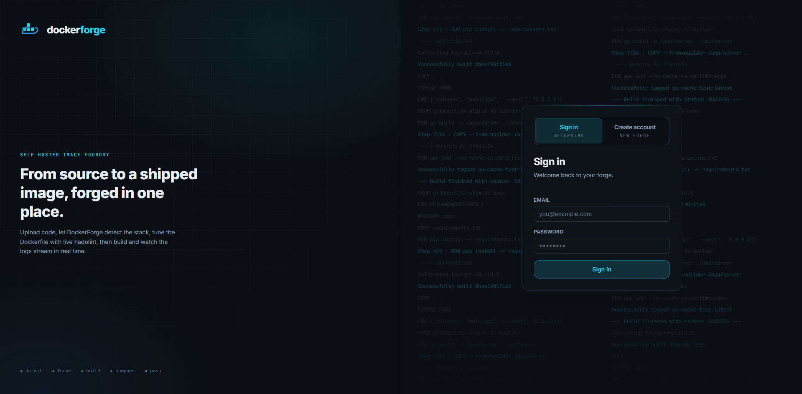
*Figure 6.1 — The sign-in / registration screen.*

To sign out, use the account menu and choose **Sign out**.

## 6.2 The Dashboard

The dashboard lists your projects, most recently updated first. Each entry shows the
project name, its detected language/framework (once source has been analysed), and
its most recent build activity. From here you can open a project, create a new one,
or page through the list.

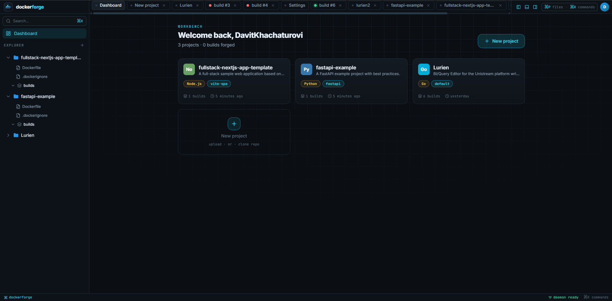
*Figure 6.2 — The projects dashboard with the list of projects.*

## 6.3 Creating a Project

1. Click **New Project**.
2. Enter a **name** (1–100 characters) and an optional **description**.
3. Confirm to create the project. It opens with no source yet — your next step is to
   provide the source code.

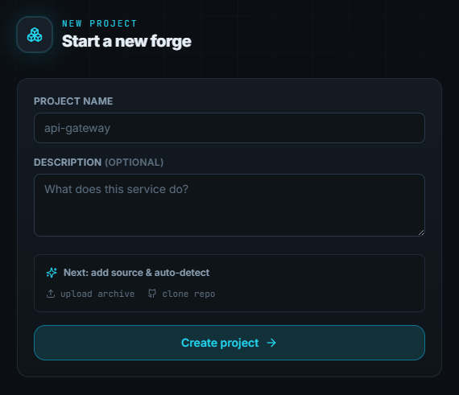
*Figure 6.3 — Creating a new project.*

## 6.4 Providing Source Code

A project needs source code before it can be analysed or built. There are two ways to
provide it.

**Option A — Upload an archive.** Drag a `.zip` or `.tar` archive of your project onto
the upload area, or browse for it. The archive is extracted on the server and analysed
automatically. (Uploads are size-limited; see your administrator's settings.)

**Option B — Clone a Git repository.** Enter an `https://github.com/...` repository URL
and a branch (defaults to `main`). For a private repository, also provide a personal
access token; it is used only for the clone and is never stored in the project.

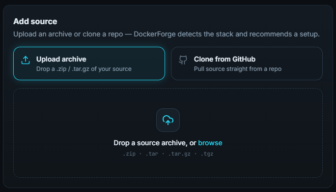
*Figure 6.4 — Uploading an archive or cloning a Git repository.*

As soon as the source is in place, DockerForge analyses it and shows the detection
result.

## 6.5 Reviewing Detection and Configuring the Project

After analysis, DockerForge proposes a configuration: the detected **language** and
**framework**, a **confidence** score, the **dependency file** it found, a suggested
**startup command**, **entry point**, **port**, and (where relevant) a base image,
binary name, or build output directory. A warning is shown if more than one language
was detected.

Review these values and adjust anything that isn't right — detection is a helpful
starting point, not the final word. You can edit the language, framework, startup
command, entry point, exposed port, base image, and environment variables. If you
change the source later, use **Detect** to re-run analysis.

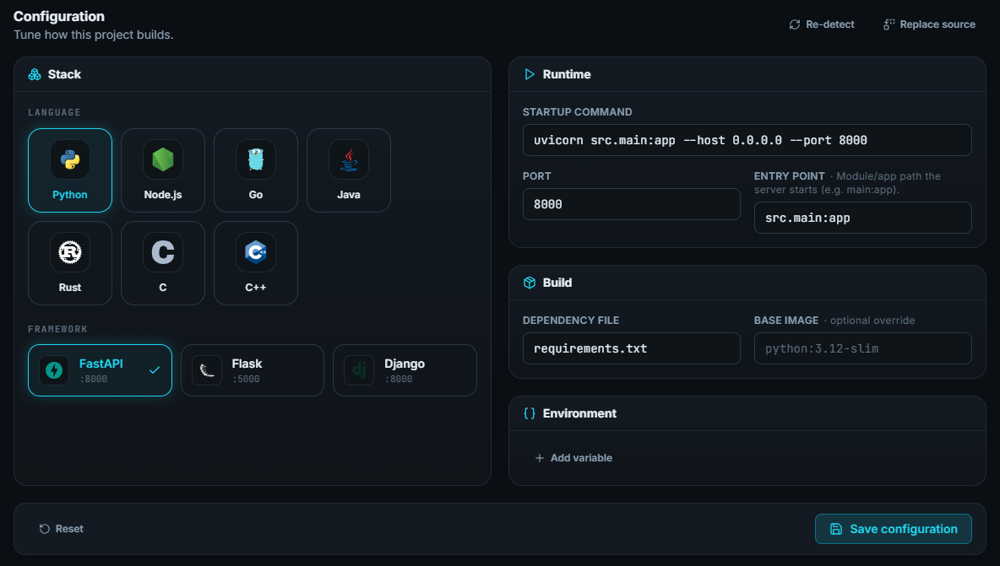
*Figure 6.5 — Detection results with editable project settings.*

## 6.6 Previewing and Editing the Dockerfile

Before building, you can see exactly what will be built.

1. Open **Dockerfile Preview**. DockerForge generates an optimized, multi-stage,
   non-root Dockerfile from your project's settings, alongside a matching
   `.dockerignore`.
2. The Dockerfile opens in an editor. You may edit it freely; your edited version is
   what gets built.
3. As you edit, the Dockerfile is **linted with hadolint** — issues appear inline with
   their rule code (e.g. `DL3008`), severity, and line number, so you can clean them
   up before building.

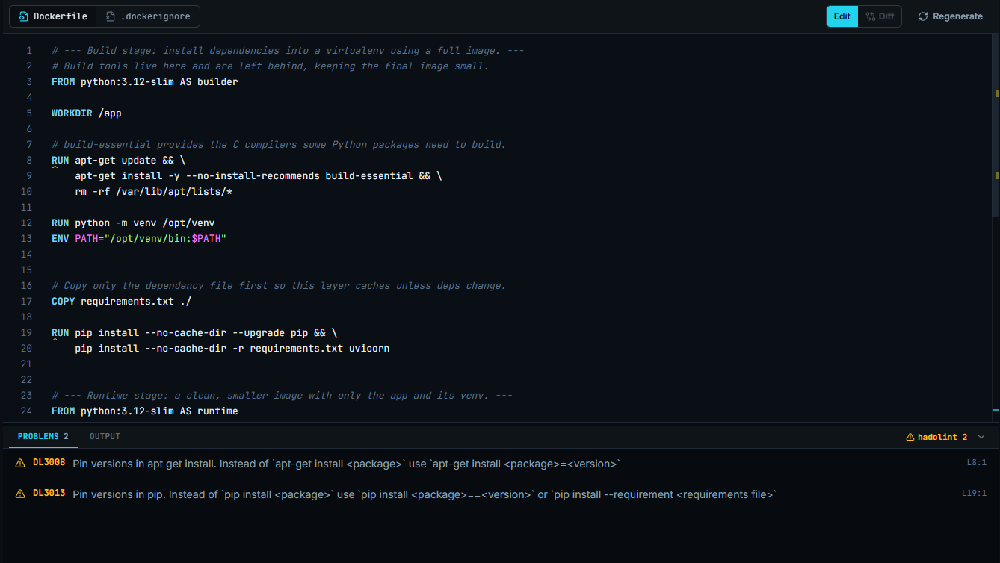
*Figure 6.6 — The Dockerfile preview/editor with inline lint feedback.*

## 6.7 Running a Build and Watching Live Logs

1. From the project, start a build. You can optionally set an **image tag**, toggle
   **no-cache**, and supply build arguments or environment variables.
2. The build is queued and runs on the server. The build view streams **live logs** as
   each step executes, with standard output and errors distinguished.
3. You can leave and return to the build view; the log feed reconnects and replays the
   output. If you no longer need the build, use **Cancel** to stop it.

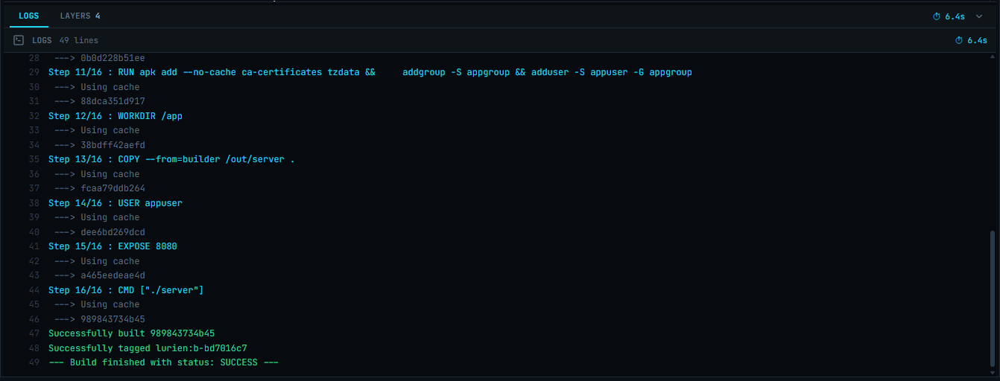
*Figure 6.7 — Streaming build logs in real time.*

## 6.8 Build Results: Image, Layers, Download, and Push

When a build succeeds, the build detail view shows the resulting **image tag**, its
total **size**, and a per-**layer** breakdown (instruction and size). From here you can:

- **Download** the image as a `.tar` archive (load it elsewhere with `docker load`).
- **Push** the image to a container registry — provide the target repository, tag, and
  registry credentials. Push progress streams live, like build logs.

Built images are removed automatically after a configurable time-to-live, so download
or push them while they are still available. You can also delete an image manually.

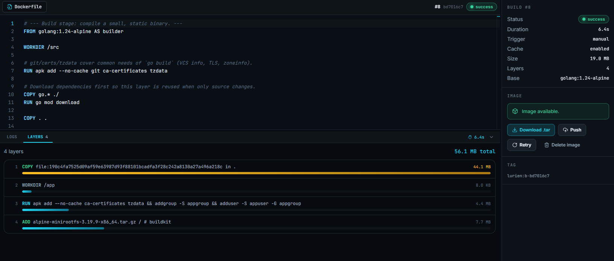
*Figure 6.8 — A successful build showing image size and layers.*

## 6.9 Managing Builds: History, Retry, and Comparison

Each project keeps a full **build history** with status, trigger type, duration, and
timestamps. From the history you can:

- **Retry** a build — re-runs it with the same Dockerfile and configuration.
- **Compare** two builds — DockerForge produces a layer-by-layer diff, marking each
  layer as unchanged, changed, added, or removed, along with the overall image-size and
  duration differences. This is useful for seeing what made an image grow or shrink.
  Because it compares the resulting images, both builds must have succeeded.
- **Compare configurations** of two builds — a separate diff of the build *inputs*
  (Dockerfile, `.dockerignore`, and configuration snapshot) that works for builds in any
  status. This is useful for answering "what changed between the build that failed and
  the one that worked?"

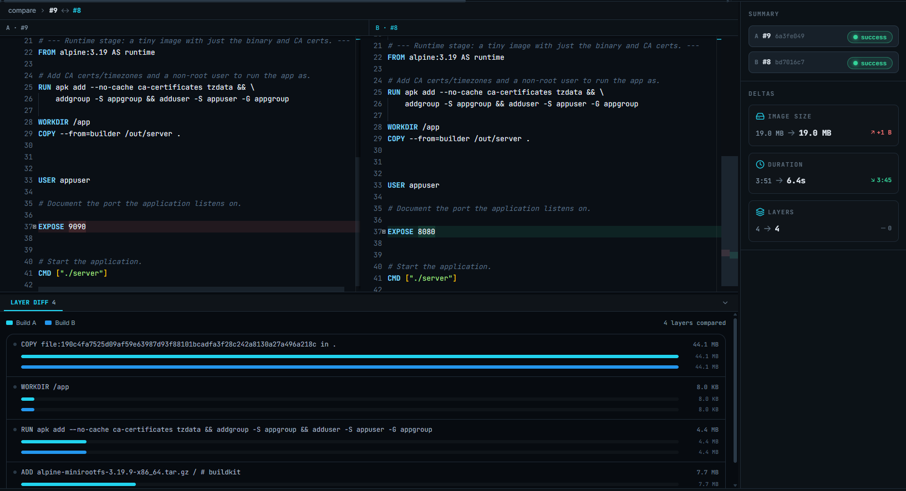
*Figure 6.9 — A side-by-side build comparison.*

## 6.10 Project Statistics

The project statistics view aggregates your build activity: total and successful
builds, success rate, average/fastest/slowest durations, average and total image
sizes, and a cached-versus-no-cache comparison that shows the effect of Docker layer
caching on build time.

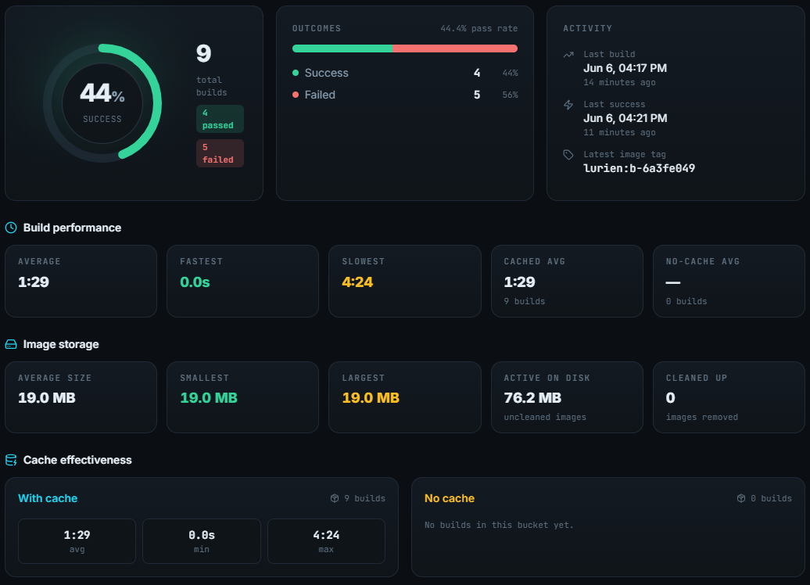
*Figure 6.10 — Aggregated project build statistics.*

## 6.11 Account and Application Settings

From the **account** menu you can update your username or email and change your
password (changing the password requires your current one).

Administrators can adjust **application settings** at runtime — build timeout, build
memory limit, image time-to-live and cleanup, maximum upload size, git-clone timeout,
log-stream retention, and the hadolint timeout — without restarting the server.

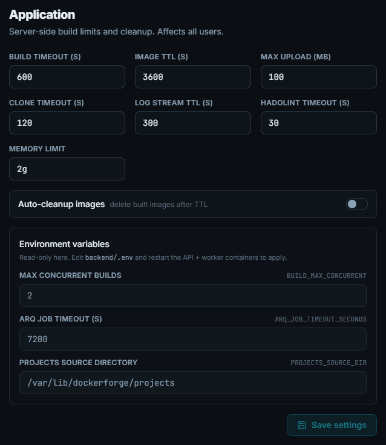
*Figure 6.11 — Runtime application settings.*

## 6.12 Worked Examples

### Example A — Dockerizing a FastAPI service from GitHub

1. Create a project named `orders-api`.
2. Clone `https://github.com/your-org/orders-api` on branch `main`.
3. DockerForge detects **Python / FastAPI**, finds `requirements.txt`, and suggests
   `uvicorn app.main:app --host 0.0.0.0 --port 8000` on port 8000.
4. Open the Dockerfile preview — a multi-stage, non-root image using
   `python:3.12-slim`. Resolve any lint warnings.
5. Build with the tag `orders-api:latest`, watch the logs, and on success review the
   image size and layers.
6. Push to your registry, or download the `.tar`.

### Example B — A React (Vite) SPA from an uploaded archive

1. Create a project named `web-dashboard` and upload its `.zip`.
2. DockerForge detects **Node / Vite SPA** and notes that the build produces static
   files served by Nginx.
3. If the app reads build-time environment variables, add them in the project settings
   — for a Vite SPA they are baked in during `npm run build`.
4. Preview the multi-stage Dockerfile (build with Node, serve with Nginx), then build
   and download or push the result.

### Example C — Measuring the impact of layer caching

1. For an existing project, run a build with **no-cache** enabled, then run a normal
   (cached) build.
2. Open **Project Statistics** to see the cached-versus-no-cache duration comparison.
3. Use **Compare** on the two builds to see, layer by layer, where the time and image
   size differences come from.

# 7. Recommendations and Future Work

This chapter records the engineering lessons that emerged while building DockerForge,
documents the language-detection heuristic developed during the project, states the
system's known limitations honestly, and lists the enhancements that would most
improve it.

## 7.1 Engineering Lessons Learned

### 7.1.1 Upstream error messages cannot be trusted — validate every parameter

The most costly debugging episode of the project came from a Docker build call that
consistently failed with `invalid reference format` for the image tag `go-test:latest`
— a tag that is unambiguously valid. Considerable effort went into the tag itself:
logging its exact bytes, checking for hidden/zero-width characters, normalising
encoding, and comparing against Docker's reference grammar. Everything confirmed the
tag was correct.

The actual cause was an unrelated parameter. The build was passing a `container_limits`
dictionary that included `nano_cpus`. `nano_cpus` is a valid option for *creating a
container* but **not** for the Docker SDK's image `build()` call; the API rejected the
request and returned a misleading message naming the tag rather than the offending
field. Removing `nano_cpus` from `container_limits` resolved it immediately, and CPU
limits for builds are simply handled differently from runtime container limits — which
is why the current `AppSettings.container_limits` deliberately exposes only `memory`
and `memswap`.

**Recommendation / lesson:** when a third-party API reports an error, treat the named
field as a hint, not a diagnosis. Validate *all* parameters of the failing call, not
just the one the message blames. A short, parameter-by-parameter elimination would
have found this in minutes; trusting the message cost days.

### 7.1.2 Reproducible builds require explicit version pinning

The backend originally declared dependencies without version constraints. This is
convenient early on but means two installs weeks apart can resolve to different
versions, and a transitively-provided package (here, `redis`, pulled in by `arq`) can
silently disappear or change. Pinning every direct dependency to a known-good version
— and promoting `redis` to a direct dependency because the code imports it directly —
makes the image reproducible and removes a class of "works on my machine" failures.

**Recommendation:** pin direct dependencies; depend explicitly on what you import
rather than relying on transitive provision; keep platform-specific transitive
packages out of the shared requirements file so the same file builds on every target
OS.

### 7.1.3 A single source of truth for configuration prevents drift

Language and framework knowledge is centralised in one `LANGUAGES` structure that
drives detection, template selection, the public `/languages` endpoint, and default
values at once. An earlier design scattered this information, which made adding a
framework a multi-file change prone to inconsistency. Consolidating it means a new
framework is a single, type-checked edit.

### 7.1.4 "Detect, suggest, confirm" is more robust than full automation

Heuristic detection is never perfect. Rather than silently acting on a guess,
DockerForge surfaces what it detected (with a confidence score and warnings) and lets
the user confirm or override before anything is built. This pattern turns occasional
detection errors from hard failures into a quick edit, and it scales gracefully to
projects the heuristics don't fully understand.

### 7.1.5 Choose the simplest transport that fits the problem

Real-time log delivery went through three designs — pub/sub, pub/sub plus a replay
buffer, and finally Redis Streams — before settling on the one primitive that handled
live tailing, history replay, and reconnection without a race condition. Likewise,
Server-Sent Events were chosen over WebSockets because logs are one-directional.
**Lesson:** match the mechanism to the actual communication shape; added capability
that goes unused is added complexity and added failure modes.

### 7.1.6 Mind the platform and the toolchain's real capabilities

Two issues reinforced this. First, `asyncio.create_subprocess_exec` raises
`NotImplementedError` under the default Windows event loop, so git clone was moved to
`subprocess.run` wrapped in a thread — simpler and portable, with no downside for a
one-shot command. Second, the Dockerfile templates were briefly upgraded to use
BuildKit cache mounts, then reverted: the docker-py SDK drives the **legacy** build
engine, which does not support BuildKit features, so the templates were kept
legacy-safe. **Lesson:** confirm that the layer actually executing your instructions
supports the features you write for it.

## 7.2 The Language-Detection Heuristic (Research Outcome)

DockerForge identifies a project's language with a lightweight scoring model rather
than a learned classifier, which keeps it fast, dependency-free, and fully
explainable.

**Scoring.** For each candidate language, the detector scans the project's root files
and the set of file extensions present:

- **+2** for each recognised dependency file found at the project root
  (`requirements.txt`, `package.json`, `go.mod`, `pom.xml`, `Cargo.toml`, …).
- **+1** for a matching source extension — applied to **C, C++, and Rust only**, where
  the dependency-file signal is weak or shared. (Python, Node, Go, and Java are scored
  on dependency files alone, since a stray `.py` or `.js` is a poor signal next to a
  manifest.)

**Confidence.** Let *s₁* be the highest score and *s₂* the runner-up. If only one
language scores, confidence is `1.0`. Otherwise:

```
confidence = s1 / (s1 + s2)
```

bounded between `0.5` (a tie — maximum ambiguity) and `1.0` (a single contender). The
winning language's framework is then inferred by a language-specific pass (for example,
inspecting `package.json` dependencies to distinguish NestJS, a Vite SPA, or Express).

**Design rationale.** Dependency files are weighted above extensions because a manifest
is a far stronger signal of intent than scattered source files — a JavaScript project
may contain a `setup.py` helper, but its `package.json` should still dominate. C-versus-C++
ambiguity is resolved by exclusion: a project scores as C only if it has C sources and
*no* C++ sources.

**Known limitation.** Because confidence is a ratio, it cannot distinguish a 3-to-1
score from a 6-to-2 score — both yield `0.75`. This is defensible (in both cases the
winner is three times stronger than the runner-up, and absolute magnitude adds little
certainty), but it does mean the score reflects *relative* dominance, not evidence
volume.

**Recommended improvements.** Add entry-point file presence (`main.py`, `index.js`,
`main.go`) as an additional weighted signal; read an existing `Procfile`/`Dockerfile`
for startup hints; and detect a Java main class from `pom.xml`/`build.gradle`.

## 7.3 Known Limitations

**Build isolation / security.** Building user-supplied source with `docker build` on a
shared host daemon is inherently sensitive. DockerForge mitigates this with build
timeouts, a memory limit, non-privileged builds, per-build temporary contexts,
symlink-escape and path-traversal checks, and managed-label cleanup of leaked images —
but it does not provide hard tenant isolation. A production-grade, multi-tenant
deployment should add a stronger sandbox: a gVisor runtime, rootless Docker, or
one-build-per-VM/microVM isolation.

**Concurrency.** The worker builds at most `BUILD_MAX_CONCURRENT` images at once
(default 2). This is appropriate for self-hosted team use but is not a horizontally
scaled build farm.

**Single-owner projects.** Each project belongs to exactly one user, and access is
masked as `404` for anyone else. This keeps the model simple but means a project
cannot currently be shared across a team (see the collaboration enhancement below).

**Detection coverage.** The 13 templates cover the most common frameworks but not
Next.js, Poetry-based Python, PHP, Ruby, or .NET. Makefile-based C/C++ projects cannot
have their binary name auto-detected (the user must specify it), and a TypeScript
project without a `start` script may receive an imperfect startup-command suggestion.

**Automated tests.** The project currently has no automated test suite; verification is
manual (via the Swagger UI and end-to-end builds). Adding tests is the single highest-
value robustness improvement (see below).

## 7.4 Recommended Future Enhancements

- **A test suite.** Unit tests for the detector and Dockerfile generator (pure,
  deterministic functions ideal for testing), plus integration tests for the build
  pipeline against a disposable Postgres/Redis, would protect against regressions and
  is the most worthwhile next investment.
- **Project collaboration (shared projects).** Allow multiple users to work on the same
  project rather than the current strictly single-owner model — shared membership with
  role-based permissions (for example owner / editor / viewer), so a team can manage a
  project's source, builds, and settings together. This would extend the ownership
  check from a single `user_id` to a project-membership relation and surface shared
  projects in each member's dashboard.
- **Stronger build sandboxing.** gVisor, rootless Docker, or per-build microVMs to move
  from "mitigated" to "isolated" execution of untrusted code.
- **Broader framework support.** Next.js (parsing `next.config.js` output mode), Poetry
  (`poetry install`), and templates for PHP, Ruby, and .NET.
- **Richer detection signals.** Entry-point scoring, `Procfile`/existing-`Dockerfile`
  hints, and Java main-class detection, as described in §7.2.
- **Build-cache analysis.** Surface suggestions (e.g. reordering `COPY`/`RUN` steps) to
  improve cache hit rates, building on the existing layer-comparison data.
- **Webhook notifications.** Notify external systems on build completion to support
  CI-style automation.
```